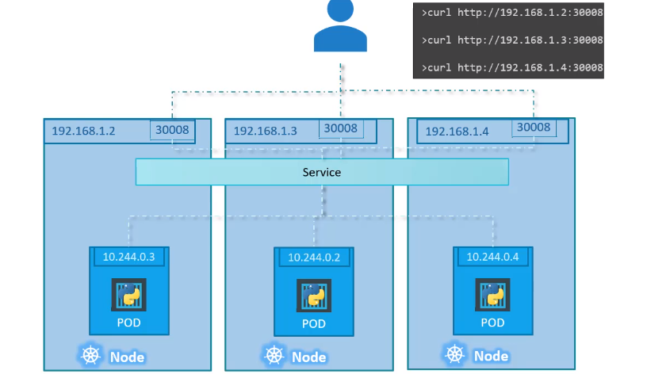

# Certified Kubernetes Application Developer

# Core Concepts

All the kubernetes yaml declarative file contain this four sections at the root of the document: 

```yaml
apiVersion:
kind:
metadata:
spec:
```


## Pod

The Pod is the minimum deployment unit and can contain more than one container.

```yaml
apiVersion: v1
kind: Pod
metadata:
  name: podname
  labels:
    labelname: labelValue
spec:
  containers:
  - name: containername
    image: imagename
```

> Pod definition using yaml file

### commands

```bash
$> kubectl run <podname> --image=<podimage>
```

> command to run a pod called *podname* pulling the image called *podimage*


## ReplicaSet

kubernetes controller are the brain behind kubernetes, a process that monitor kubernetes objects and respond accordingly

replication controller is one of the most important kubernetes controller. It helps run multiple instances of the same Pod providing HA. If you have one single Pod, replication controller allows you to restart the Pod in case of failure. Replication controller ensure that the predefined number of Pod is running in your cluster.


another reason to use replica controller is to create multiple Pod in order to share the load between them. The replications controller use all the node in the cluster to distribute the created Pods.


```yaml
apiVersion: v1
kind: ReplicationController
metadata:
  name: rc-name
  label:
  app: myapp
spec:
- template:
    metadata:
    name: podname
    label:
      labelname: labelValue
    spec:
      containers:
      - name: containername
        image: imagename
replicas: 3
```

> replication controller definition using yaml file


```yaml
apiVersion: app/v1
kind: ReplicationSet
metadata:
  name: rs-name
  label:
  app: myapp
spec:
- template:
    metadata:
    name: podname
    label:
      labelname: labelValue
    spec:
      containers:
      - name: containername
        image: imagename
replicas: 3
selector:
  matchLabels:
    labelname: labelValue
```

> replica set definition using yaml file

**ReplicaSet** need the selector field because it is able to handle also Pod created outside the replica set controller. With the **matchLabels** field we are indicating that the replica set are controlling all the Pod with that label defined.

If you want to scale your number of pod once the replicaset is created you can act in three way

```bash
$> kubectl replace -f replicaset-definition.yml

$> kubectl scale --replicas=6 -f replicaset-definition.yml

$> kubectl scale --replicas=6 replicaset rs-name
```


## Deployments

Deployments is a kubernetes object that is on top of replicaset. It provide the capability to update the underling instances of the pod using rolling update strategy (for example).


```yaml
apiVersion: apps/v1
kind: Deployment
metadata:
  name: deployment-name
  labels:
  app: myapp
spec:
  template:
    metadata:
      name: podname
      labels:
        labelname: labelValue
    spec:
      containers:
      - name: containername
        image: imagename
  replicas: 3
  selector:
    matchLabels:
      labelname: labelValue
```

> deployment definition using yaml file

Once you create a new deployment, a new replicaset is automatically created by kubernetes in order to handle the scale in/out of the Pod.

## Namespaces

The **default** namespace is create automatically when the cluster is first setup. The namespace **kube-system** contain all pod, services and resources used by kubernetes itself to works. In the name space **kube-public** all resources are made available for all users.

If you want to create different environments for Dev and Prod and isolate them, you can create two different namespaces.


We can assign a resources quota for each namespace we define. 


> this is the way to identify a service in a different namespace

If you want to specify a namespace to use when a kubernetes object is created, you need to specify it in the yaml file

```yaml
apiVersion: v1
kind: Pod
metadata:
  name: podname
  namespace: Dev
  label:
    labelname: labelValue
spec:
  containers:
  - name: containername
    image: imagename
```

> Pod definition in Dev environment (namespace) using yaml file

Here you can find a simple declarative definition to create a namespace into a k8s cluster

```yaml
apiVersion: v1
kind: Namespace
metadata:
  name: Dev
```

> Pod definition in Dev environment (namespace) using yaml file

To get a set of object in a different namespace you have to specify it in the command line
```bash
$> kubectl get pods --namespace=Dev

$> kubectl get pods -n Dev
```

By default the current namespace the Kubectl command is using is the **default**; we can permanently switch to another namespace usin the follow command

```bash
$> kubectl config set-context $(kubectl config current-context) --namespace=Dev
```

To view pods in all namespaces use the following  command

```bash
$> kubectl get pods --all-namespaces
```

### Resource quota


# Configuration

## Commands and arguments in Docker

Running a container means executing a task, after that the container exit; a container lives as long as the process inside it is running.

To define the task that run at the container start up we need to define a section in the Docker  file called **CMD**.

We can override the docker command present in the Docker file definition, simply adding it to the docker run command

```bash
$> docker run ubuntu sleep 5
```

to let this command permanent we need to define our own image starting from ubuntu one


```dockerfile
FROM ubuntu
CMD sleep 5

...

CMD ["sleep", "5"]

```

the second one is the json array format, and the first element must be the executable.

to build the new image we created we have to use the docker build command

```bash
$> docker build -t ubuntu-sleeper .
```

Suppose we want to pass an arguments to the run command specifying the number of seconds to sleep, we can use the ENTRYPOINT section instead of CMD in the dockerfile

```dockerfile
FROM ubuntu
ENTRYPOINT ["sleep"]
```
in this way, after build image, we can lunch the command

```bash
$> docker run ubuntu-sleeper 10
```

using ENTRYPOINT we have to specify the parameters for the command, in case we don't specify it we got an error. We can define a default values for the parameters in this way

```dockerfile
FROM ubuntu
ENTRYPOINT ["sleep"]
CMD ["5"]
```


## Commands and arguments in Kubernetes


This is the way we can define parameters for a Pod in Kubernetes

```yaml
apiVersion: v1
kind: Pod
metadata:
  name: ubuntu-sleeper-pod
spec:
  containers:
  - name: ubuntu-sleeper
    image: ubuntu-sleeper
    command: ["sleep.20"]
    args: ["10"]
```

With the **args** parameter specified in the yaml file we are going to override the **CMD** parameter of the  image, with the **command** field we are going to override the entry point of the docker image.

## Environment variables

We can specify environment variable value for the Pod using Key-value pair format

```yaml
apiVersion: v1
kind: Pod
metadata:
  name: ubuntu-sleeper-pod
spec:
  containers:
  - name: ubuntu-sleeper
    image: ubuntu-sleeper
    env:
      - name: ENV_VARIABLE_1
        value: EnvVariableValue1
      - name: ENV_VARIABLE_2
        value: EnvVariableValue2
```

We can also define environment variable value reading from **secret**

```yaml
apiVersion: v1
kind: Pod
metadata:
  name: ubuntu-sleeper-pod
spec:
  containers:
  - name: ubuntu-sleeper
    image: ubuntu-sleeper
    env:
      - name: ENV_VARIABLE_1
        valueFrom:
          secretKeyRef:
            secret
```

Or  reading from **configmap**

```yaml
apiVersion: v1
kind: Pod
metadata:
  name: ubuntu-sleeper-pod
spec:
  containers:
  - name: ubuntu-sleeper
    image: ubuntu-sleeper
    env:
      - name: ENV_VARIABLE_1
        valueFrom:
          configMapKeyRef:
            configMap
```


## ConfigMaps

ConfigMaps contain all configuration data for the Pod. One use case is to store environment variable value as we saw before.

```bash
# config-map
ENV_VARIABLE_1=EnvVariableValue1
ENV_VARIABLE_2=EnvVariableValue2
```

```yaml
apiVersion: v1
kind: Pod
metadata:
  name: ubuntu-sleeper-pod
spec:
  containers:
  - name: ubuntu-sleeper
    image: ubuntu-sleeper
    envFrom:
      - configMapKeyRef:
          name: config-map
```

There are two phases in handle config map for a Pod

- create config map
- inject file into a Pod

We can create ConfigMap object using imperative command specifying all the value in  the command line arguments

```bash
$> kubectl create confimap config-map \
			--from-literal=<key1>=<value1> \
			--from-literal=<key2>=<value2>
```

Otherwise we can create a file containing all the environment variable values and then create the config map specifying the file name where to find all the values

```bash
$> kubectl create confimap config-map \
			--from-file=<path-to-file>
```

We can have an imperative approach to define the configmap object in kubernetes, defining a declarative file in this way

```yaml
apiVersion: v1
kind: ConfigMap
metadata:
  name: config-map
data:
  ENV_VARIABLE_1: "EnvVariableValue1"
  ENV_VARIABLE_2: "EnvVariableValue2"
```

Once we have created the config map object into the k8s ecosystem, we have to assign it to the related Pod that need it

```yaml
apiVersion: v1
kind: Pod
metadata:
  name: ubuntu-sleeper-pod
spec:
  containers:
  - name: ubuntu-sleeper
    image: ubuntu-sleeper
    envFrom:
      - configMapKeyRef:
          name: config-map
```

we can inject only one variable instead all the values

```yaml
apiVersion: v1
kind: Pod
metadata:
  name: ubuntu-sleeper-pod
spec:
  containers:
  - name: ubuntu-sleeper
    image: ubuntu-sleeper
    envFrom:
      - configMapKeyRef:
          name: config-map
          key: ENV_VARIABLE_1
```


## Secrets

Secrets are used to store sensitive information like user name and passwords. They are similar to config map but the value are store using encoded format. Like we did for config map we need two step to work with secret

- create the secret
- inject the secret into the pod

We can use the usual two ways to create a secret, first is the imperative approach

```bash
$> kubectl create secret generic my-secret \
			--from-literal=<key1>=<value1> \
			--from-literal=<key2>=<value2>
```

As we did for configmap we can define a file with all the values and then create a secret pointing to the file

```bash
$> kubectl create secret generic my-secret \
			--from-file=<path-to-file>
```

We can also use the declarative approach defining a yaml file for the secret

```yaml
apiVersion: v1
kind: Secret
metadata:
  name: my-secret
data:
  KEY_1: "Value1"
  KEY_2: "Value2"
```

Instead of using literal values for the key is better to encode the value using base64 format, and this can be done with the following command

```bash
$> echo -n 'value-to-encode' | base64
```

to decode the value we should use the following command

```bash
$> echo -n 'encoded-value' | base64 --decode
```

Once we have created the secret we have to inject into the pod

```yaml
apiVersion: v1
kind: Pod
metadata:
  name: my-pod
spec:
  containers:
  - name: my-pod
    image: ubuntu-sleeper
    envFrom:
      - secretRef:
          name: my-secret
```


## Docker security

Container are not completely isolated from the host, indeed host share the same kernel. The only isolation is about **namespaces** used to execute container; in this way the container can see only processes inside its namespace, and nothing outside it.

The host can see the process of the container with a different process id. 

By default docker run processes within container as a **root** user; we can specify a different user id to lunch processes in the docker container

```bash
$> docker run --user=1000 ubuntu sleep 3600
```

Otherwise we can define the user id directly into the Dockerfile used to create the image

```dockerfile
FROM ubuntu
...
USER 1000
```

Running  a process inside the container as a root user, means that this user is the same root of the host, so it can do everything the host root user can do, in the reality docker take some action about this root user, meaning this user is not really the root user of the host. By default docker run the container with a limited set of capabilities, so the process running into the docker doesn't have all privileges.  

We can add or drop privileges using a parameter in the command line

```bash
$> docker run --cap-add MAC_ADMIN ubuntu sleep 3600

$> docker run --cap-drop KILL ubuntu sleep 3600
```

We can also run the process with all the privileges enabled

```bash
$> docker run --privileged ubuntu sleep 3600
```


## Security contexts

We can choose to define security level at a container level or at a Pod level; in this case all the container running inside the Pod have the same security level. 

We can configure security level directly in the Pod declarative file


```yaml
apiVersion: v1
kind: Pod
metadata:
  name: my-pod
spec:
  securityContext:
    runAsUser: 1000
  containers:
  - name: my-pod
    image: ubuntu
    command: ["sleep", "3600"]
```

Or at container level

```yaml
apiVersion: v1
kind: Pod
metadata:
  name: my-pod
spec:
  containers:
  - name: my-pod
    image: ubuntu
    command: ["sleep", "3600"]
    securityContext:
      runAsUser: 1000
      capabilities:
        add: ["MAC_ADMIN"]
```


## Service Accounts

There are two type of accounts in kubernetes

- User account (used by humans)
- Service account (used by machine)


To create a service account use the following command

```bash
$> kubectl create serviceaccount <account-name>
```

When a service account is created it is created also a token automatically. The token is used by application to authenticate in kubernetes and interact with the api. The token is stored as a secret object and the secret object is linked to the service account. 

The token should be used as a **bearer token** for the authentication to kubernetes api as the following example show

```bash
$> curl https://kubernets.url:6443/api -insecure \
    --header "Authorization: Bearer ejB..."
```

> In case of application running on the kubernetes cluster itself, we can simply mounting the service token secret as a volume inside the Pod.

Listing the service account in the system we can see that there is a **default** service account already present. Each namespace has its own service account created. 

**When a Pod is created automatically a volume with the namespace service account token is mounted.** It is always mounted at the ***/var/run/secrets/kubernetes.io/serviceaccount*** location.
Instead of using the default service account in the Pod you can define your own service account after its creation

```yaml
apiVersion: v1
kind: Pod
metadata:
  name: my-pod
spec:
  containers:
  - name: my-pod
    image: ubuntu
    command: ["sleep", "3600"]
  serviceAccount: my-service-account
```

You can prevent to mount the default service account automatically specifying the following filed in the declarative file

```yaml
apiVersion: v1
kind: Pod
metadata:
  name: my-pod
spec:
  containers:
  - name: my-pod
    image: ubuntu
    command: ["sleep", "3600"]
  automountServiceAccountToken: false
```


## Resource Requirements

For each node there are three resource

- CPU
- Memory
- Disk

When a Pod will run in a node, it occupies an amount of resource, and is in charge of the scheduler to decide in which node run the selected Pod. The scheduler check the amount of resources for the Pod and what are available in the nodes. 

If no resources are available in the nodes the new Pod remain in the **Pending** state, and looking into the event we can detect the reason why the Pod could not be scheduled (for example insufficient CPU). 

> If no resources are defined for the Pod, kubernetes by default use an amount of 0.5 CPU and 256 Mi of memory

To define the amount of CPU and memory the pod  need we have to declare it into the yaml file

```yaml
apiVersion: v1
kind: Pod
metadata:
  name: my-pod
spec:
  containers:
  - name: my-pod
    image: ubuntu
    command: ["sleep", "3600"]
    resources:
      requests:
        memory: "1Gi"
        cpu: 1
```

We can set a limit for the resources the Pod can use, in order to prevent the Pod grow

```yaml
apiVersion: v1
kind: Pod
metadata:
  name: my-pod
spec:
  containers:
  - name: my-pod
    image: ubuntu
    command: ["sleep", "3600"]
    resources:
      requests:
        memory: "256Mi"
        cpu: 100m
      limits:
        memory: "512Mi"
        cpu: 500m      
```

Limit and requests are set for each container in the Pod. 

In case the Pod are going to use more resources as the limit defined, in case of CPU it is throttled, in case of memory the Pod will be terminated.

## Taints and Tolerations

Taints and tolerations are used to set **restrictions** on how Pod can be schedule on a node.  **Taints** are set on node and **Tolerations** are set on Pod

When a Pod is created K8s try to schedule it in an available node. We can inform the scheduler to place the Pod in a particular node, in case we need resources of that node. 

We can prevent the Pod to be placed in a node defining a taint of the node; by default Pod has no toleration, so no Pod can tolerate in taint. We can define which Pod are tolerant to a particular taint. 

How to set a taint in a node:

```bash
$> kubectl taint nodes <node-name> key=value:taint-effect
```

How toun set a taint in a node:

```bash
$> kubectl taint nodes <node-name> key=value:taint-effect-
```

the taint effect has three values

- **NoSchedule** the Pod will not be schedule on the node
- **PreferNoSchedule** the system will try to avoid to place the Pod in the node
- **NoExecute** the Pod will not be schedule on the node and existing Pod will be evicted

How to add a toleration to a Pod:

```yaml
apiVersion: v1
kind: Pod
metadata:
  name: my-pod
spec:
  containers:
  - name: my-pod
    image: ubuntu
    command: ["sleep", "3600"]
  tolerations:
  - key: "app"
    operator: "Equal"
    value: "blue"
    effect: "NoSchedule"
```


## Node selectors

We can use label assign to a node to identify where you want to execute a particular Pod using **nodeSelector**.

```yaml
apiVersion: v1
kind: Pod
metadata:
  name: my-pod
spec:
  containers:
  - name: my-pod
    image: ubuntu
    command: ["sleep", "3600"]
  nodeSelector:
    size: Large
```

In this case the key value pair size=Large is a label assigned to a specific node.

How we can label a node:

```bash
$> kubectl label nodes <node-name> <label-key>=<label-value>
```

using node selectors you cannot achieve all the possible configuration, for example if you wanna execute a Pod in a node that is labelled Large or Medium.


## Node affinity

With node affinity we ensure that Pods are hosted in particular node. 

```yaml
apiVersion: v1
kind: Pod
metadata:
  name: my-pod
spec:
  containers:
  - name: my-pod
    image: ubuntu
    command: ["sleep", "3600"]
  affinity:
    nodeaffinity:
      requiredDuringSchedulingIgnoredDuringExecution:
        nodeSelectorTerms:
        - matchExpressions:
          - key: size
            operator: In
            values:
            - Large
```

What if a Pod affinity do no match any node.

the type of node affinity are

- **requiredDuringSchedulingIgnoredDuringExecution** the pod will not be schedule if no match found
- **preferredDuringSchedulingIgnoredDuringExecution** the pod will be schedule in a node event if no match found

any changes in node affinity will not impact to any pod, because both are Ignored.

## Taints and Tolerations vs Node Affinity

Both used separately cannot guarantee that all the Pod allocation problem could be solved. Using together would be better to solve all kind of allocation problem.

# Multi-Container PODs

In a Pod all the containers shares the same life cycle, share the same network space (refer each other using localhost) and they have access to the same storage volume.

There are different patterns of multi container Pods

## Ambassador

When we want to communicate with different data base server depending on the environment our application is deployed we can consider to use the ambassador pattern, taking in charge the right communication due the environment; for example the main Pod can always refer to localhost and the ambassador works as a proxy and redirect the connection to the right environment database.

## Adapter

We are going to use this kind of pattern when we want to convert the format coming form the main container into a standard different format. 

## Sidecar

The best example of sidecar patter is to deploy a separate container alongside a web server container to perform log and send it to a Log server.

# Observability

## Readiness and Liveness Probes

There are some states in which the Pod can be

- **Pending**, when a Pod is just created and should be scheduled in one node. If is impossible to schedule it remains in the pending state (using the command kubectl describe pod we can inspect the reason why the pod remain in pending status)
- When the Pod is schedule is going to **ContainerCreating** state. When all the container inside the Pod are running then the Pod switch to **running** state

The Pod ha a list of condition that are boolean flags indicating the status of the pod

- PodScheduled
- Initialized
- ContainersReady
- Ready

To see these flag status we should run the kubectl describe pod command. The ready condition indicate the application inside the pod (one or more containers) is running and is ready to accept user traffic. 

Kubernetes by default assumes that once the pod is created is ready to accept traffic, so the service route traffic immediately to the pod. Sometimes this condition is not real, because some applications need time to warm up (e.g. web servers or database servers).

Using **readiness probe** we can inform k8s engine our pod is up and running, through HTTP, TCP and CMD calls.

```yaml
apiVersion: v1
kind: Pod
metadata:
  name: my-pod
spec:
  containers:
  - name: my-pod
    image: ubuntu
    
    readinessProbe:
      httpGet:
        path: /healtz
        port: 8080
        
      tcpSocket:
        port: 3306
        
      exec:
        command:
        - cat
        - /app/is_ready
      
      initialDelaySeconds: 10 # initial delay before calling the readiness probe 
      periodSeconds: 5 # to specify how often to probe
      failureThreshold: 5 # to set a threshold after that the pod is marked as error
      
```

using the liveness probe we are going to inform k8s when our application inside the pod is running in he right way and can accept traffic from the user. When the liveness probe fails kubernetes restart our pod in order to ensure the application is running well. The liveness probe is called periodically by kubernetes to check the healthy status of the application.


```yaml
apiVersion: v1
kind: Pod
metadata:
  name: my-pod
spec:
  containers:
  - name: my-pod
    image: ubuntu
    
    livenessProbe:
      httpGet:
        path: /healtz
        port: 8080
        
      tcpSocket:
        port: 3306
        
      exec:
        command:
        - cat
        - /app/is_ready
      
      initialDelaySeconds: 10 # initial delay before calling the liveness probe 
      periodSeconds: 5 # to specify how often to probe
      failureThreshold: 5 # to set a threshold after that the pod is marked as error
      
```


## Container logging

we can inspect and show the logs related to a pod using the command


```bash
$> kubectl logs -f <pod-id>
```

in case of multiple container inside the pod we have to specify which container we wanna show the log


```bash
$> kubectl logs -f <pod-id> <container-name>
```


## Monitor and Debug applications

Kubernetes provide the **metric server** to debug and monitor the applications inside a cluster. We can have one metric server per kubernetes cluster. Metric server receive metrics from nodes and pods, aggregate that and store in memory (does not store metrics on  the disk). So you cannot access to historical data, so you must rely to another solution (prometheus, datadog, dynatrace, ...).

Kubelet running in each node is responsible to gather all the metric information for each Pod using **cAdvisor** component. Through cAdvisor all the metric are exposed as a kubelet api.

Here the two command using the metric server

```bash
$> kubectl top node

$> kubectl top pod
```

# POD design

## Labels, Selectors and Annotations

Labels and selectors are the standard way to group things together. Label are properties attach to each item in kubernetes ecosystem. Selectors give you the capabilities to filter the items due to the attached labels.

For each object we can create in k8s (pod, deploy, replicasets, ...) we can attach a label to it and then use selector to filter what you want.

Labels are defined under the metadata section of each object we are going to create. We can specify every label we need as a key value pattern.

After that we can use the selectors for each command


```bash
$> kubectl get pods --selector <key>=<value>,<key1>=<value1>
```


## Rolling Updates & Rollbacks in Deployments

Using deployment we can achieve the capabilities to deploy new version of our app, and in case something goes wrong to rollback to a previous version.

To check the status of a rollout we can use the command

```bash
$> kubectl rollout status deployment/<deployment-name>
```

in case you wanna take a look to the revisions we can use the command

```bash
$> kubectl rollout history deployment/<deployment-name>
```

There are two types of deployment strategies:

- **Recreate** strategy where all the running Pod are destroyed and recreated (we can have an application downtime)
- **Rolling update** where we can destroy a small amount of Pod and recreate them (no downtime). This is the default deployment strategy

When we update the deployment definition file and apply the changes a new rolling update is triggered.

Try to understand how it works. When a new deployment is created the first thing is to create a replicaset belonging to the deploy itself. The replicaset is the object that ensure the number of Pod is strictly equals to the Replicas definition. When we are going to update the deployment, a new replicaset is created, and this new replicaset is the owner of the new Pod. 

In case something goes wrong we can rollback to the previous version using the command:

```bash
$> kubectl rollout undo deployment/<deployment-name>
```


## Jobs

Workload such as batch, analytics or reporting should be done using Jobs that perform a task for a certain period of time and then terminate. 

If we are going to use a normal Pod to execute some task, remember that the Pod will be restarted when terminate. We can consider to use the **restartPolicy** field set to **Never** (by default is Always) to avoid Kubernetes to restart the Pod. 

```yaml
apiVersion: v1
kind: Pod
metadata:
  name: my-pod
spec:
  containers:
  - name: my-pod
    image: ubuntu
    command: ["expr","1","+","3"]
  restartPolicy: Never
```

Take  a look how to define a Job in kubernetes

```yaml
apiVersion: batch/v1
kind: Job
metadata:
  name: my-job
spec:
  template:
    spec:
      containers:
      - name: my-pod
        image: ubuntu
        command: ["expr","1","+","3"]
      restartPolicy: Never
```

Using the filed completions we can inform kubernetes to start n Pod one after the other till it reach the number specified:

```yaml
apiVersion: batch/v1
kind: Job
metadata:
  name: my-job
spec:
  completions: 3
  template:
    spec:
      containers:
      - name: my-pod
        image: ubuntu
        command: ["expr","1","+","3"]
      restartPolicy: Never
```

We can also created the Pod in parallel 

```yaml
apiVersion: batch/v1
kind: Job
metadata:
  name: my-job
spec:
  completions: 3
  parallelism: 3
  template:
    spec:
      containers:
      - name: my-pod
        image: ubuntu
        command: ["expr","1","+","3"]
      restartPolicy: Never
```


## CronJobs

A **CronJob** is a Job that can be schedule. 

How to define a CronJob

```yaml
apiVersion: batch/v1beta1
kind: CronJob
metadata:
  name: my-job
spec:
  schedule: "*/1 * * * *"
  jobTemplate:
    spec:
      completions: 3
      parallelism: 3
      template:
        spec:
          containers:
          - name: my-pod
            image: ubuntu
            command: ["expr","1","+","3"]
          restartPolicy: Never
```

# Services & networking

## Services

Through services we enable communication between user and applications, and also between applications. 

Take a look to networking in kubernetes


we can access the Pod from kubernetes node, if we want to access the Pod directly from user desktop we need to consider to add a service that expose the application.

We can define different kind of service

- **NodePort** service that enable port forwarding from inside to outside the cluster by mapping a port on the node to a port on the pod


There are three ports involved by this service. The port on the Pod that is the **TargetPort** where the service forward the requests. The second one is the port of the service itself, simply called **Port**. The service has its own IP address that is called **ClusterIP** address. And finally we have the port on the node which is used to access the service and this is called **NodePort** (NodePort could be in a valid range from 30000 to 32676)

```yaml
apiVersion: v1
kind: Service
metadata:
  name: my-service
spec:
  type: NodePort
  ports:
  - targetPort: 80
    port: 80
    nodePort: 30008
  selector:
    key: value # pointing to the deployment or the pod
```

In case of multiples node the service will be create for all the nodes an map the same port of the node to the service itself




- **ClusterIP** the service create an IP inside the cluster to enable communication

If we need to establish a connectivity between services. It is not possible to rely to the Pod IP address because the Pod is ephemeral and can die. Using **ClusterIP** we can define a service with an IP and a name that is accessible by other services in the Cluster using the IP or the name.

```yaml
apiVersion: v1
kind: Service
metadata:
  name: my-service
spec:
  type: ClusterIP
  ports:
  - targetPort: 80
    port: 80
  selector:
    key: value # pointing to the deployment or the pod
```


- **LoadBalancer** provide a load balancer for our application based on cloud provider

## Ingress Networking

In order to expose your application from a cluster to the outside world you have to create a service. If you work in the cloud you should use the service as **LoadBalancer** so the cloud provider can instantiate a load balancer service and you can use the IP to set up in the right way your DNS (the load balancer at the end acts as a proxy server to route traffic to your kubernetes service).  


In this way to approach the problem there are a lot of configuration to do outside the kubernetes cluster. Maybe we can do this work in a different way, that is where ingress comes in.


the ingress entry point should be exposed as a service of type NodePort or LoadBalancer.

Kubernetes cluster does not come with and ingress controller. So we have to deploy one. 

NGINX is a perfect match for kubernetes and it is deployed as another deployment in the target cluster. It's important to separate the deployment stuff from the configuration of nginx using configmap containing all the settings

```yaml
apiVersion: extnesions/v1beta1
kind: Deployment
metadata:
  name: ingress-controller
spec:
  replicas: 1
  selector:
    matchLabels:
      name: nginx-ingress  
  template:
    metadata:
      name: podname
      labels:
        name: nginx-ingress
    spec:
      containers:
      - name: nginx-ingress-controller
        image: quay.io/kubernetes-ingress-controller/nginx-ingress-controller:0.21.0

      args:
      - /nginx-ingress-controller
      - --configmap=$(POD_NAMESPACE)/nginx-configuration
      
      env:
      - name: POD_NAME
        valueFrom:
          fieldRef:
            fieldPath: metadata.name
      - name: POD_NAMESPACE
        valueFrom:
          fieldRef:
            fieldPath: metadata.namespace     
      
      ports:
      - name: http
        containerPort: 80
      - name: https
        containerPort: 443
```

After that we have to create a service of type NodePort to expose the ingress controller just created:

```yaml
apiVersion: v1
kind: Service
metadata:
  name: nginx-ingress
spec:
  type: NodePort
  ports:
  - port: 80
    targetPort: 80
    protocol: TCP
    name: http
  - port: 443
    targetPort: 443
    protocol: TCP
    name: https
  selector:
    name: nginx-ingress  
```

At the end the ingress controller require a service account with the right role and role binding

```yaml
apiVersion: v1
kind: ServiceAccount
metadata:
  name: nginx-ingress-serviceaccount
```


Next part is creating ingress resources where we define all the route to internal services.

```yaml
apiVersion: extensions/v1beta1
kind: Ingress
metadata:
  name: ingress-path
spec:
  backend:
    serviceName: path-service
    servicePort: 80
```

In this way all the traffic are routed to the path service. We can specify different route defining the **Rules**. 

```yaml
apiVersion: extensions/v1beta1
kind: Ingress
metadata:
  name: ingress-path
spec:
  rules:
  - http:
      paths:
      - path: /wear
        backend:
          serviceName: wear-service
          servicePort: 80

      - path: /watch
        backend:
          serviceName: watch-service
          servicePort: 80
```

In this way, in case of wrong requests path, the route goes to a default backend service that should be implemented.

In case we want to route to a different service by the domain name we have to use the host field


```yaml
apiVersion: extensions/v1beta1
kind: Ingress
metadata:
  name: ingress-path
spec:
  rules:
  - host: wear.mysite.com
    http:
      paths:
      - backend:
          serviceName: wear-service
          servicePort: 80
  - host: watch.mysite.com 
    http:
      paths:
      - backend:
          serviceName: watch-service
          servicePort: 80
```


## Network policies

By default each pod deployed in a cluster is able to communicate with the other without introducing any kind of configuration; this mean that kubernetes is configured by default as "**All Allow**" that allow traffic from any pod to any other pod or services. 

What if we want to avoid some services to communicate with other services? that is why we introduce **network policies** to allow only certain traffic between pod and services.

Network policies is another kubernetes object that allow you to specify which kind of traffic (ingress or egress) one Pod can allow. To associate network policy to a pod we use the labels and selectors.


```yaml
apiVersion: networking.k8s.io/v1
kind: NetworkPolicy
metadata:
  name: db-policy
spec:

  podSelector:
    matchLabels:
      role: db

  policyTypes:
  - Ingress
  
  ingress:
  - from:
    - podSelector:
        matchLabels:
          name: api-pod
       nameSpaceSelector:
         matchLabels:
           name: prod
    - ipBlock:
        cidr: 192.168.0.5/32
        
    ports:
    - protocol: TCP
      port: 3306
```

> This policy allow any Pod that match the provided label in any namespaces present, indeed we added a **nameSpaceSelector** that match exactly what we want. With **ipBlock** we can allow access from external services defining the IP address.

# State persistence

## Volumes

Container by definition are immutable so all the data stored inside a container disappear when the container die. For this reason persistent volumes comes in. The container should store data in the attached volume in order to keep it. 

Take a look to this Pod that run a a command to generate a random file and store it into a file

```yaml
apiVersion: v1
kind: Pod
metadata:
  name: my-pod
spec:
  containers:
  - image: alpine
    name: alpine
    command: ["/bin/sh", "-c"]
    args: ["shuf -i 0-100 -n 1 >> /opt/number.out"]
```

to retain the generated number we have to create a volume for the Pod and Storage for the volume itself. We can configure to use a directory on the host node in this way

```yaml
apiVersion: v1
kind: Pod
metadata:
  name: my-pod
spec:
  containers:
  - image: alpine
    name: alpine
    command: ["/bin/sh", "-c"]
    args: ["shuf -i 0-100 -n 1 >> /opt/number.out"]
    
  volumes:
  - name: data-volume
    hostPath:
      path: /data
      type: Directory
```

Once the volume is created we have to mount it in a directory inside the container

```yaml
apiVersion: v1
kind: Pod
metadata:
  name: my-pod
spec:
  containers:
  - image: alpine
    name: alpine
    command: ["/bin/sh", "-c"]
    args: ["shuf -i 0-100 -n 1 >> /opt/number.out"]
    volumeMounts:
    - mountPath: /opt
      name: data-volume
    
  volumes:
  - name: data-volume
    hostPath:
      path: /data
      type: Directory
```

take a look to the volume storage optionscto store a state in a folder of the host

```yaml
  volumes:
  - name: data-volume
    hostPath:
      path: /data
      type: Directory
```

In this way each node has it own directory and this could be a non optimal solution in case we want every Pod in every node read the same data, for this reason we need a cluster storage solution. 

Kubernetes supports various storage solutions such as NFS, ClusterFS, Flocker, ScaleIO, ceph and public cloud solution fro AWS, GCP and Azure. for example if we wanna use AWS elastic block store we have to define

```yaml
  volumes:
  - name: data-volume
    awsElasticBlockStore:
      volumeID: <volume-id>
      fsType: ext4
```

## Persistent volumes and claims

We can approach the storage solution for kubernetes in a centric way instead of defining it inside each Pod definition. 
**Persistent volume** are a cluster wide pool of volumes that can be used by the Pod.

```yaml
apiVersion: v1
kind: PersistentVolume
metadata:
  name: pv-vol1
spec:
  accessModes:
    - ReadWriteOnce
  capacity:
    storage: 1Gi
  awsElasticBlockStore:
    volumeID: <volume-id>
    fsType: ext4
```

Access mode define how the volume should be mounted on the host. 

- ReadWriteOnce
- ReadOnlyMany
- ReadWriteMany

Once we have defined and created a persistent volume, to let it available to use from the Pod. When a **persistent volume claims** is created k8s bind it to a persist volume based on the name. *There are one-to-one relationship between claim and volume* and the bind could be done also using labels and selectors. 

In case of no persistent volume available the claims remain in the pending state; when a new PV comes available in the cluster automatically the PVC will be bind to the new PV.


```yaml
apiVersion: v1
kind: PersistentVolumeClaim
metadata:
  name: my-claim
spec:
  accessModes:
    - ReadWriteOnce
  resources:
    requests:
      storage: 500Mi
```

We can delete a claim in every moment, but what happen to the PV bound with the PVC? you can specify what is the policy in this scenario using  the **persistentVolumeReclaimPolicy** property by default set to **Retain** 

- **Retain** the PV remain and it is not available for reuse by other claim
- **Delete** as soon as the claim is deleted, the underline PV will be deleted as well
- **Recycle** in this case the data in the volume will be deleted before assigning the PV to other claim

Here you can find an example how to define a Pod using a persistent volume claim

```yaml
apiVersion: v1
kind: Pod
metadata:
  name: mypod
spec:
  containers:
    - name: myfrontend
      image: nginx
      volumeMounts:
      - mountPath: "/var/www/html"
        name: mypd
  volumes:
    - name: mypd
      persistentVolumeClaim:
        claimName: myclaim
```

>  https://kubernetes.io/docs/concepts/storage/persistent-volumes/#claims-as-volumes

## Storage classes

Working with PV means that before creating it you have to create in the cloud provider a disk with a particular name and use it inside the PV definition. As we saw before we define a PV for AWS using elastic block storage, this mean that before creating the PV we need to create the EBS. This way of working is called *static provisioning volume*.

Using storage classes we define a provisioner that is able to create dynamically the storage we need. The parameters we define in the storage class depends on the provisioner.

```yaml
apiVersion: storage.k8s.io/v1
kind: StorageClass
metadata:
  name: google-storage
provisioner: kubernetes.io/gce-pd
parameters:
  type: pd-standard
  replication-type:  none
```

Using storga class we don't need the definition of PV because it will be created automatically. For the PVC we have to specify the storage class name to use.

```yaml
apiVersion: v1
kind: PersistentVolumeClaim
metadata:
  name: my-claim
spec:
  accessModes:
    - ReadWriteOnce
  storageClassName: google-storage
  resources:
    requests:
      storage: 500Mi
```

when we create the PVC using  a storage class the provisioner defined in it will be called in order to create the disk of the requests size, and then a PV will be automatically created for the disk and bounded to the PVC.

## Stateful sets

Stateful set are a particular object in kubernetes and define how Pod are going to be created. In stateful set the Pod have always the same name starting from 0 to the number of replicas minus 1.


The problem with this kind of architecture is that we cannot know how to call a specific Pod that is important in any master-slave architecture. 

To solve this problem we need to define a headless service that allow kubernetes to add a specific DNS for each Pod created by a stateful set. The headless service does not load balancing traffic between the Pod but add only the right DNS for each Pod in order to let the other applications to use it. An headless service is created like a normal service, but it does not have an IP its own.


```yaml
apiVersion: v1
kind: Service
metadata:
  name: mysql-h
spec:
  ports:
    port: 3306
  selector:
    app: mysql
  
  # this is imprtant
  clusterIP: None
```

```yaml
apiVersion: v1
kind: StatefulSet
metadata:
  name: mysql-ss
  labels:
    app: mysql
spec:
  serviceName: mysql-h # to identify the headless service
  replicas: 3
  matchLabels:
    app: mysql
  template:
    metadata:
      name: myapp-pod
      labels:
        app: mysql
    spec:
      containers:
      - name: mysql
        image: mysql
```


# Tips

> Code to get a 15% discount during the registration **DEVOPS15**

> in the exam you can only use **vi** or **nano** to edit yaml files

> kubectl config set-context MYCONTEXT --namespace=NAMESPACE

> https://kubernetes.io/docs/reference/generated/kubectl/kubectl-commands

```bash
$> kubectl run nginx --image=nginx # create a Deployment

$> kubectl run nginx --image=nginx --restart=Never # create a Pod

$> kubectl run nginx --image=nginx --restarrt=OnFailure # create a Job

$> kubectl run nginx --image=nginx --restart=OnFailure --schedule="* * * * *" # create a CronJob

```

