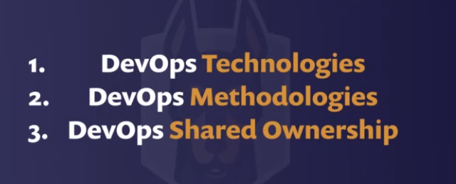
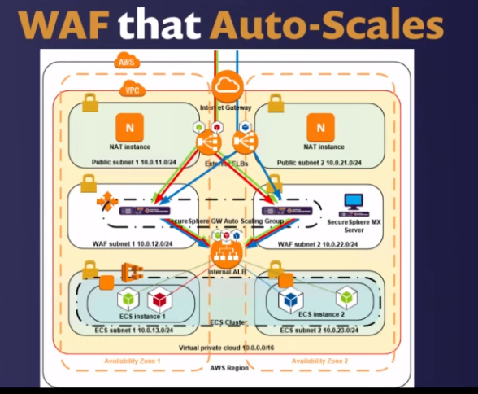
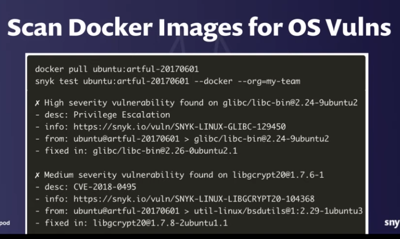
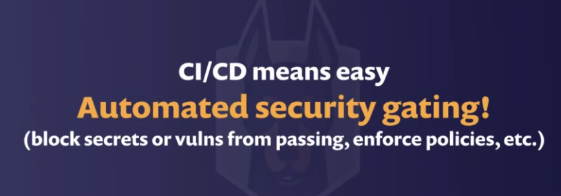
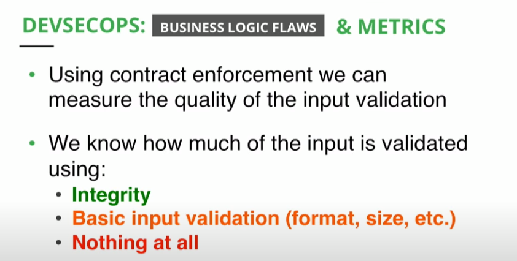
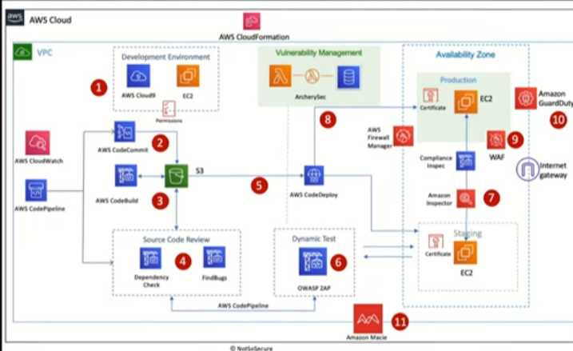

# DevSecOps

DevSecOps, also known as SecDevOps, is a software development philosophy that promotes the adoption of security through the entire software development lifecycle. DevSecOps goes beyond a single tool or specific practice, but generally speaking, it favors **security automation, communication, and scalability**. This development philosophy scope includes all teams involved in the SDLC, such as development, operations, and security.

scale and speed

but what does devops mean

But what does devsecops mean?

## software composition analysis

## DevSecOps

## SAST 

**Static Application Security Testing** also known as code analyzers, perform a **direct white-box analysis of the application source code**. The analysis runs on a static view of code, meaning that the code is not running at the time of the review. These days, SAST security tools are fully mainstream, and they are widely adopted across the software industry.

## DAST

**Dynamic Application Security Testing** also known as web scanner. As opposed to SASTs, **DASTs conduct black-box analysis of the application**, meaning that they do not have access to the code or the implementation details. DASTs examine only the system’s responses to a battery of tests designed to highlight vulnerabilities. They are, in short, a [vulnerability scanner](https://owasp.org/www-community/Vulnerability_Scanning_Tools).

## SAST vs DAST

# SAST & DAST vs IAST: All You Need to Know About AST Tools

AST tools are one of the pillars of any Application Security practice. We believe that applications should be built secure from the very beginning, so we advocate for developers to take an active role in AppSec. As a result, we believe that all developers should have a basic knowledge of Application Security Testing (AST) tools such as SAST and DAST, compared to the more modern IAST. However, we still find that developers and architects frequently lack a good understanding of them.

### Table of contents

**[What is SAST? A short definition](https://hdivsecurity.com/bornsecure/sast-dast-vs-iast-all-you-need-to-know-about-ast-tools/#what-is-sast-a-short-definition)**
**[What is DAST?](https://hdivsecurity.com/bornsecure/sast-dast-vs-iast-all-you-need-to-know-about-ast-tools/#what-is-dast)**
**[SAST vs DAST](https://hdivsecurity.com/bornsecure/sast-dast-vs-iast-all-you-need-to-know-about-ast-tools/#sast-vs-dast)**
**[What is IAST? The modern AST tool](https://hdivsecurity.com/bornsecure/sast-dast-vs-iast-all-you-need-to-know-about-ast-tools/#what-is-iast-the-modern-ast-tool)**
**[SAST vs DAST vs IAST](https://hdivsecurity.com/bornsecure/sast-dast-vs-iast-all-you-need-to-know-about-ast-tools/#sast-vs-dast-vs-iast)**
**[Beyond the IAST: upgrading to a RASP](https://hdivsecurity.com/bornsecure/sast-dast-vs-iast-all-you-need-to-know-about-ast-tools/#beyond-the-iast-upgrading-to-rasp)**

**So what exactly are SAST, DAST, and IAST? How do SAST vs DAST compare to IAST? Let’s do a quick review including definitions, pros, and cons.**

Gartner is credited as having coined the Application Security terms SAST, DAST, and IAST

## WHAT IS SAST? A SHORT DEFINITION

[SAST](https://hdivsecurity.com/bornsecure/what-is-sast-static-application-security-testing/) or Static Application Security Testing tools, also known as code analyzers, perform a **direct white-box analysis of the application source code**. The analysis runs on a static view of code, meaning that the code is not running at the time of the review. These days, SAST security tools are fully mainstream, and they are widely adopted across the software industry.

### Pros

- Broad programming language support
- The principle is easy to understand

### Cons

- Poor accuracy: 53% of issues detected are non-existent (false positives) [1]
- Antiquated technology that has not evolved
- SAST code analyzers have no visibility of the execution flow
- The output is a static report that quickly becomes outdated
- They often require some customization or tuning
- Not applicable to systems in Production stage
- Can be slow

## WHAT IS DAST?

Let’s continue with one of the best-known AST tools, the veritable [Dynamic Application Security Testing (DAST)](https://hdivsecurity.com/bornsecure/dast-dynamic-application-security-testing/), also known as web scanner. As opposed to SASTs, **DASTs conduct black-box analysis of the application**, meaning that they do not have access to the code or the implementation details. DASTs examine only the system’s responses to a battery of tests designed to highlight vulnerabilities. They are, in short, a [vulnerability scanner](https://owasp.org/www-community/Vulnerability_Scanning_Tools).

### Pros

- Independent of the underlying app technology and platform
- DASTs provide good support for manual pentesting

### Cons

- Insufficient coverage: a best-in-class DAST detects only 18% of issues [1]
- No information on the location of the issue in the codebase
- Security background is required to interpret the results
- The output is a static report that quickly becomes outdated
- Can be slow

## SAST VS DAST

The main difference between SAST and DAST is that a SAST provides a **static and internal** analysis of the application, while a DAST provides a **dynamic (runtime) and external** analysis of the application.

In terms of **detection accuracy**, a SAST code scanner will find more security issues than a DAST, at the cost of having a large number of false positives.

And in terms of fit to the **SDLC stages**, a SAST will fit well in the Development and QA stages, while a web scanner is mostly useful during QA and Production stages, as it requires the application to be up and running to work. On the other hand, a SAST requires direct access to the source code, while a DAST does not.

## IAST

**Interactive Application Security Testing** *is designed to address the shortcomings of SAST and DAST by combining elements of both approaches. IAST places an agent within an application and performs all its analysis in the app in real-time and anywhere in the development process ­­ IDE, continuous integrated environment, QA or even in production*

## RASP

 **Run-time Application Security Protection**  As with IAST, RASP, or Run­time Application Security Protection, works inside the application, but it is less a testing tool and more a security tool

## SCA

**Software Composition Analysis**

# Stages

# GitOps

​	

