# Distributed systems patterns

*Replicated Write Ahead Log*

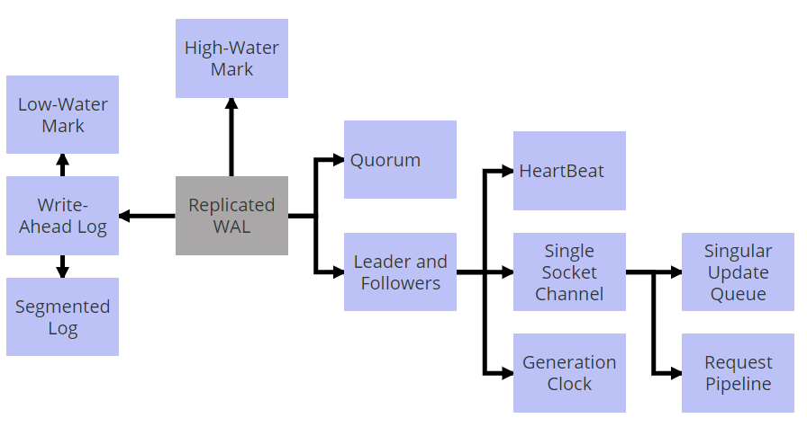


## Write-Ahead log

*Provide durability guarantee without the storage data structures to be flushed to disk, by persisting every state change as a command to the append only log.*

### Problem

Strong durability guarantee is needed even in the case of the server machines storing data failing. Once a server agrees to perform an action, it should do so even if it fails and restarts losing all of its in-memory state

### Solution

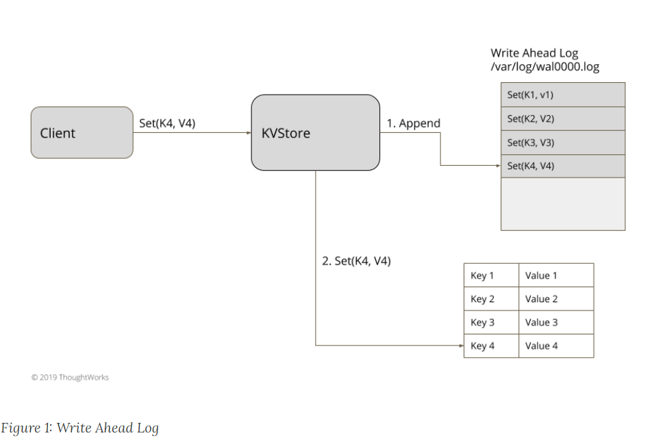


Store each state change as a command in a file on a hard disk. A single log is maintained for each server process which is sequentially appended. A single log which is appended sequentially, simplifies the handling of logs at restart and for subsequent online operations (when the log is appended with new commands). Each log entry is given a unique identifier

## Segmented Log

*Split log into multiple smaller files instead of a single large file for easier operations.*

### Problem

A single log file can grow and become a performance bottleneck while its read at the start up. Older logs are cleaned up periodically and doing clean up operations on a single huge file is difficult to implement

### Solution

Single log is split into multiple segments. Log files are rolled after a specified size limit.

```java
public Long writeEntry(WALEntry entry) {
    maybeRoll();
    return openSegment.writeEntry(entry);
}

private void maybeRoll() {
    if (openSegment.
            size() >= config.getMaxLogSize()) {
        openSegment.flush();
        sortedSavedSegments.add(openSegment);
        long lastId = openSegment.getLastLogEntryId();
        openSegment = WALSegment.open(lastId, config.getWalDir());
    }
}
```


## Low-Water Mark

*An index in the write ahead log showing which portion of the log can be discarded.*

### Problem

The write ahead log maintains every update to persistent store. It can grow indefinitely over time. **Segmented Log** allows dealing with smaller files at a time, but total disk storage can grow indefinitely if not checked

### Solution

Have a mechanism to tell logging machinery which portion of the log can be safely discarded. **The mechanism gives the lowest offset or low water mark, before which point the logs can be discarded**. Have a task running in the background, in a separate thread, which continuously checks which portion of the log can be discarded and deletes the files on the disk.

```java
this.logCleaner = newLogCleaner(config);
this.logCleaner.startup();
The Log cleaner can be implemented as a scheduled task

public void startup() {
    scheduleLogCleaning();
}

private void scheduleLogCleaning() {
    singleThreadedExecutor.schedule(() -> {
        cleanLogs();
    }, config.getCleanTaskIntervalMs(), TimeUnit.MILLISECONDS);
}

```

### Snapshot based Low-Water Mark

In this implementation, the storage engine takes periodic snapshots. Along with snapshot, it also stores the log index which is successfully applied

```java
public SnapShot takeSnapshot() {
    Long snapShotTakenAtLogIndex = wal.getLastLogEntryId();
    return new SnapShot(serializeState(kv), snapShotTakenAtLogIndex);
}
```

Once a snapshot is successfully persisted on the disk, the log manager is given the low water mark to discard the older logs.

```java
List<WALSegment> getSegmentsBefore(Long snapshotIndex) {
    List<WALSegment> markedForDeletion = new ArrayList<>();
    List<WALSegment> sortedSavedSegments = wal.sortedSavedSegments;
    for (WALSegment sortedSavedSegment : sortedSavedSegments) {
        if (sortedSavedSegment.getLastLogEntryId() < snapshotIndex) {
            markedForDeletion.add(sortedSavedSegment);
        }
    }
    return markedForDeletion;
}
```

### Time-Based Low-Water Mark

In some systems, where log is not necessarily used to update the state of the system, log can be discarded after a given time window, without waiting for any other subsystem to share the lowest log index which can be removed.

For example, in systems like Kafka, logs are maintained for 7 weeks; all the log segments which have messages older than 7 weeks are discarded.

```java
private List<WALSegment> getSegmentsPast(Long logMaxDurationMs) {
    long now = System.currentTimeMillis();
    List<WALSegment> markedForDeletion = new ArrayList<>();
    List<WALSegment> sortedSavedSegments = wal.sortedSavedSegments;
    for (WALSegment sortedSavedSegment : sortedSavedSegments) {
        if (timeElaspedSince(now, sortedSavedSegment.getLastLogEntryTimestamp()) > logMaxDurationMs) {
            markedForDeletion.add(sortedSavedSegment);
        }
    }
    return markedForDeletion;
}

private long timeElaspedSince(long now, long lastLogEntryTimestamp) {
    return now - lastLogEntryTimestamp;
}
```


## High-Water Mark

*An index in the write ahead log showing the last successful replication.*

### Problem

The **Write-Ahead Log** pattern is used to recover state after the server crashes and restarts. But a write-ahead log is not enough to provide availability in case of server failure. If a single server fails, then clients won't be able to function until the server restarts. To get a more available system, we can replicate the log on multiple servers. Using **Leader and Followers** the leader replicates all its log entries to a **Quorum** of followers. Now should the leader fail, a new leader can be elected, and clients can mostly continue to work with the cluster as before. But there are still a couple things that can go wrong:

- The leader can fail before sending its log entries to any followers.
- The leader can fail after sending log entries to some followers, but could not send it to the majority of followers.

In these error scenarios, some followers can be missing entries in their logs, and some followers can have more entries than others. So it becomes important for each follower to know what part of the log is safe to be made available to the clients.

### Solution

The high-water mark is an index into the log file that records the last log entry that is known to have successfully replicated to a **Quorum** of followers. The leader also passes on the high-water mark to its followers during its replication. All servers in the cluster should only transmit data to clients that reflects updates that are below the high-water mark.


For each log entry, the leader appends it to its local write ahead log, and then sends it to all the followers.

```java
private Long appendAndReplicate(byte[] data) {
      Long lastLogEntryIndex = appendToLocalLog(data);
      logger.info("Replicating log entries from index " + lastLogEntryIndex);
      replicateOnFollowers(lastLogEntryIndex);
      return lastLogEntryIndex;
  }


  private void replicateOnFollowers(Long entryAtIndex) {
      for (final FollowerHandler follower : followers) {
          replicateOn(follower, entryAtIndex); //send replication requests to followers
      }
  }
```

The followers handle the replication request and append the log entries to their local logs. After successfully appending the log entries, they respond to the leader with the index of the latest log entry they have. The response also includes the current **Generation Clock** of the server

```java
private ReplicationResponse handleReplicationRequest(ReplicationRequest replicationRequest) {
      List<WALEntry> entries = replicationRequest.getEntries();
      for (WALEntry entry : entries) {
          logger.info("Applying log entry " + entry.getEntryId() + " in " + serverId());
          wal.writeEntry(entry);
      }
      return new ReplicationResponse(SUCCEEDED, serverId(), replicationState.getGeneration(), wal.getLastLogEntryId());
  }
```

The Leader keeps track of log indexes replicated at each server, when responses are received.

```java
recordReplicationConfirmedFor(response.getServerId(), response.getReplicatedLogIndex());
long logIndexAtQuorum = computeHighwaterMark(logIndexesAtAllServers(), config.numberOfServers());
if (logIndexAtQuorum > replicationState.getHighWaterMark()) {
    var previousHighWaterMark = replicationState.getHighWaterMark();
    applyLogAt(previousHighWaterMark, logIndexAtQuorum);
    replicationState.setHighWaterMark(logIndexAtQuorum);
}

Long computeHighwaterMark(List<Long> serverLogIndexes, int noOfServers) {
      serverLogIndexes.sort(Long::compareTo);
      return serverLogIndexes.get(noOfServers / 2);
 }
```

The high-water mark can be calculated by looking at the log indexes of all the followers and the log of the leader itself, and picking up the index which is available on the majority of the servers.

The leader propagates the high-water mark to the followers either as part of the regular **HeartBeat** or as separate requests. The followers then set their high-water mark accordingly

Any client can read the log entries only till the high-water mark. Log entries beyond the high-water mark are not visible to clients as there is no confirmation that the entries are replicated, and so they might not be available if the leader fails, and some other server is elected as a leader.

```java
public WALEntry readEntry(long index) {
      if (index > replicationState.getHighWaterMark()) {
          throw new IllegalArgumentException("Log entry not available");
      }
      return wal.readAt(index);
  }
```

### Log Truncation

When a server joins the cluster after crash/restart, there is always a possibility of having some conflicting entries in its log. So whenever a server joins the cluster, it checks with the leader of the cluster to know which entries in the log are potentially conflicting. It then truncates the log to the point where entries match with the leader,and then updates the log with the subsequent entries to ensure its log matches the rest of the cluster

Consider the following example. The client sends requests to add four entries in the log. The leader successfully replicates three entries, but fails after adding entry4 to its own log. One of the followers is elected as a new leader and accepts more entries from the client. When the failed leader joins the cluster again, it has entry4 which is conflicting. So it needs to truncate its log till entry3, and then add entry5 to match the log with the rest of the cluster

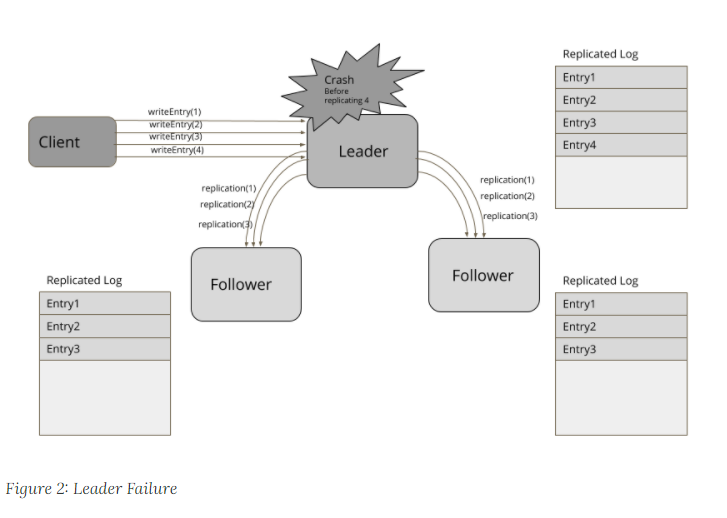

After the leader crash a new leader will be eligible

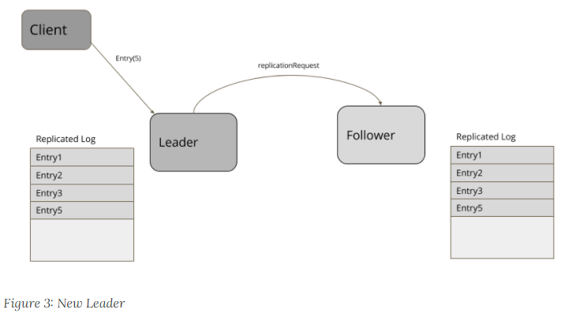

And should be synchronized truncating the log

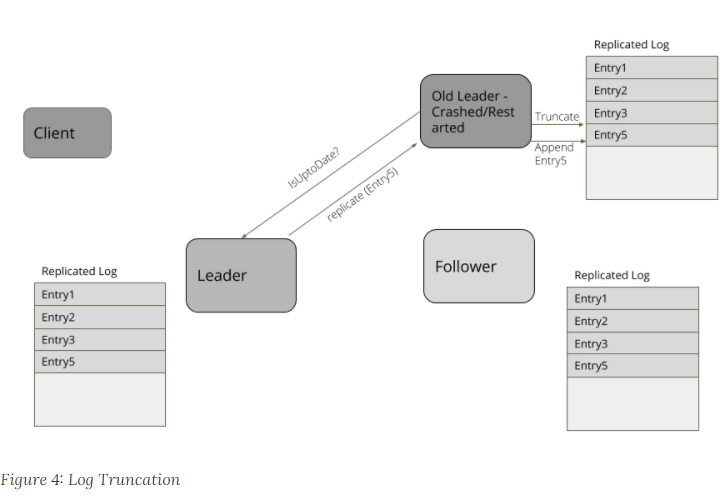

Any server which restarts or rejoins the cluster after a pause, finds the new leader. It then explicitly asks for the current high-water mark, truncates its log to high-water mark, and then gets all the entries beyond high-water mark from the leader

Replication algorithms like RAFT have ways to find out conflicting entries by checking log entries in its own log with the log entries in the request. The entries with the same log index, but at lower [Generation Clock](https://martinfowler.com/articles/patterns-of-distributed-systems/generation.html), are removed

```Java
private void maybeTruncate(ReplicationRequest replicationRequest) throws IOException {
      if (replicationRequest.hasNoEntries() || wal.isEmpty()) {
          return;
      }

      List<WALEntry> entries = replicationRequest.getEntries();
      for (WALEntry entry : entries) {
          if (wal.getLastLogEntryId() >= entry.getEntryId()) {
              if (entry.getGeneration() == wal.readAt(entry.getEntryId()).getGeneration()) {
                  continue;
              }
              wal.truncate(entry.getEntryId());
          }
      }
  }
```

A simple implementation to support log truncation is to keep a map of log indexes and file position. Then the log can be truncated at a given index, as following

```java
public void truncate(Long logIndex) throws IOException {
      var filePosition = entryOffsets.get(logIndex);
      if (filePosition == null) throw new IllegalArgumentException("No file position available for logIndex=" + logIndex);

      fileChannel.truncate(filePosition);
  }
```

## Quorum

*Avoid two groups of servers making independent decisions, by requiring majority for taking every decision.*

### Problem

In a distributed system, whenever a server takes any action, it needs to ensure that in the event of a crash the results of the actions are available to the clients. This can be achieved by replicating the result to other servers in the cluster. But that leads to the question: how many other servers need to confirm the replication before the original server can be confident that the update is fully recognized. If the original server waits for too many replications, then it will respond slowly - reducing liveness. But if it doesn't have enough replications, then the update could be lost - a failure of safety. It's critical to balance between the overall system performance and system continuity.

### Solution

A cluster agrees that it's received an update when a majority of the nodes in the cluster have acknowledged the update. We call this number a quorum. So if we have a cluster of five nodes, we need a quorum of three. (For a cluster of n nodes, the quorum is n/2 + 1.)

The need for a quorum indicates how many failures can be tolerated - which is the size of the cluster minus the quorum. A cluster of five nodes can tolerate two of them failing. In general, if we want to tolerate 'f' failures we need a cluster size of 2f + 1

Consider following two examples that need a quorum:

- **Updating data in a cluster of servers.**[High-Water Mark](https://martinfowler.com/articles/patterns-of-distributed-systems/high-watermark.html) is used to ensure only data which is guaranteed to be available on the majority of servers is visible to clients.
- **Leader election.** In [Leader and Followers](https://martinfowler.com/articles/patterns-of-distributed-systems/leader-follower.html), a leader is selected only if it gets votes from a majority of the servers.

### Deciding on number of servers in a cluster

The cluster can function only if majority of servers are up and running. In systems doing data replication, there are two things to consider:

- The throughput of write operations.

  Every time data is written to the cluster, it needs to be copied to multiple servers. Every additional server adds some overhead to complete this write. The latency of data write is directly proportional to the number of servers forming the quorum. As we will see below, doubling the number of servers in a cluster will reduce throughput to half of the value for the original cluster.

- The number of failures which need to be tolerated.

  The number of server failures tolerated is dependent on the size of the cluster. But just adding one more server to an existing cluster doesn't always give more fault tolerance: adding one server to a three server cluster doesn't increase failure tolerance.

Considering these two factors, most practical quorum-based systems have cluster sizes of three or five. A five-server cluster tolerates two server failures and has tolerable data write throughput of few thousand requests per second.

Here is an example of how to choose the number of servers, based on the number of tolerated failures and approximate impact on the throughput. The throughput column shows approximate relative throughput to highlight how throughput degrades with the number of servers. The number will vary from system to system. As an example, readers can refer to the actual throughput data published in [Raft Thesis](https://web.stanford.edu/~ouster/cgi-bin/papers/OngaroPhD.pdf) and the original [Zookeeper paper](https://www.usenix.org/legacy/event/atc10/tech/full_papers/Hunt.pdf).

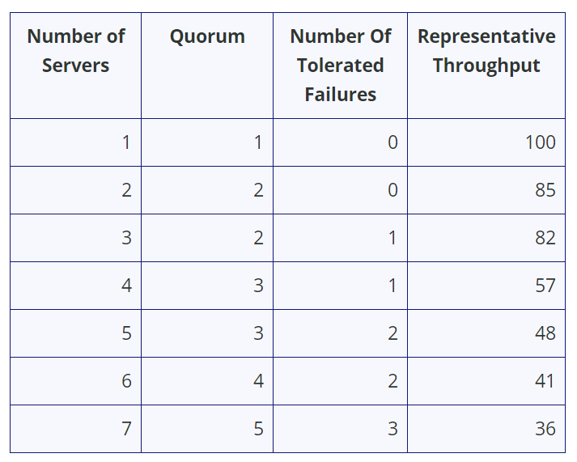


## Leader and Followers

*Have a single server to coordinate replication across a set of servers.*

### Problem

To achieve fault tolerance in systems which manage data, the data needs to be replicated on multiple servers.

It's also important to give some guarantee about consistency to clients. When data is updated on multiple servers, a decision about when to make it visible to clients is required. Write and read [Quorum](https://martinfowler.com/articles/patterns-of-distributed-systems/quorum.html) is not sufficient, as some failure scenarios can cause clients to see data inconsistently. Each individual server does not know about the state of data on the other servers in the quorum, It's only when data is read from multiple servers, the inconsistencies can be resolved. In some cases, this is not enough. Stronger guarantees are needed about the data that is sent to the clients.

### Solution

Select one server amongst the cluster as leader. The leader is responsible for taking decisions on behalf of the entire cluster and propagating the decisions to all the other servers.

Every server at start up looks for an existing leader. If no leader is found, it triggers a leader election. The servers accept requests only after a leader is selected successfully. Only the leader handles the client requests. If a request is sent to a follower server, the follower can forward it to the leader server.

### Leader Election

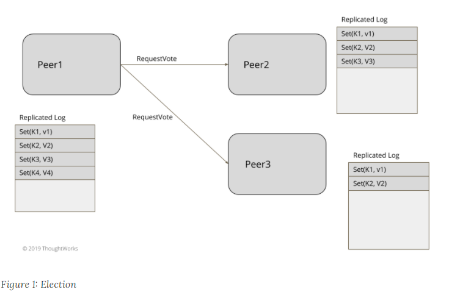

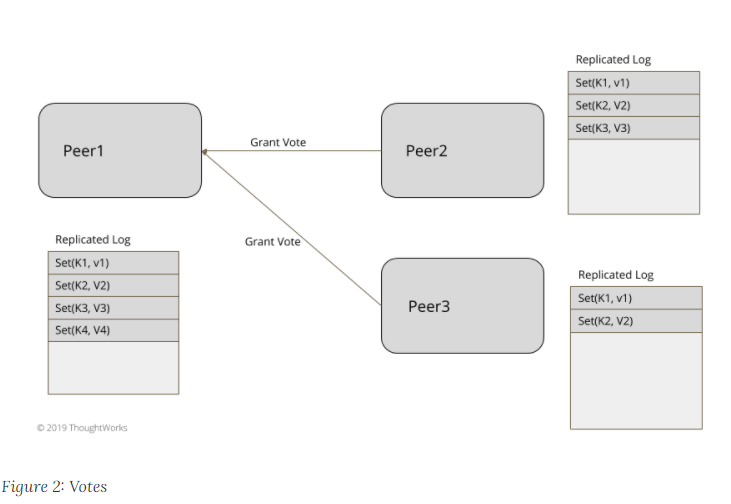

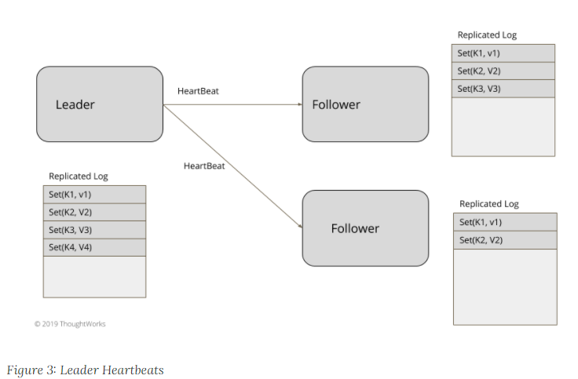

For smaller clusters of three to five nodes, like in the systems which implement consensus, leader election can be implemented within the data cluster itself without depending on any external system. Leader election happens at server start up.

Every server starts a leader election at start up and tries to elect a leader. The system does not accept any client requests unless a leader is elected. As explained in the [Generation Clock](https://martinfowler.com/articles/patterns-of-distributed-systems/generation.html) pattern, every leader election also needs to update the generation number. The server can always be in one of the three states, Leader, Follower or Looking For Leader (or Candidate)

```java
public enum ServerRole {
    LOOKING_FOR_LEADER,
    FOLLOWING,
    LEADING;
}
```

[HeartBeat](https://martinfowler.com/articles/patterns-of-distributed-systems/heartbeat.html) mechanism is used to detect if an existing leader has failed, so that new leader election can be started.

New leader election is started by sending each of the peer servers a message requesting a vote.

```java
  private void startLeaderElection() {
      replicationState.setGeneration(replicationState.getGeneration() + 1);
      registerSelfVote();
      requestVoteFrom(followers);
  }
```

### Election Algorithm

There are two factors which are considered while electing a leader.

- Because these systems are mostly used for data replication, it puts some extra restrictions on which servers can win the election. Only servers, which are the *'most up to date*' can be a legitimate leader. For example, in typical consensus based systems, The ‘most up to date’ is defined by two things:
  - The latest [Generation Clock](https://martinfowler.com/articles/patterns-of-distributed-systems/generation.html)
  - The latest log index in [Write-Ahead Log](https://martinfowler.com/articles/patterns-of-distributed-systems/wal.html)
- If all the servers are equally up to date, then the leader is chosen based following criteria:
  - Some implementation specific criteria, like which server is ranked better or has higher id. (e.g. [Zab](https://zookeeper.apache.org/doc/r3.4.13/zookeeperInternals.html#sc_atomicBroadcast))
  - If care is taken to make sure only one server asks for a vote at a time, then whichever server starts the election before others. (e.g. [Raft](https://raft.github.io/))

Once a server is voted for in a given [Generation Clock](https://martinfowler.com/articles/patterns-of-distributed-systems/generation.html), the same vote is returned for that generation always. This makes sure that some other server requesting a vote for the same generation is not elected, when a successful election has already happened. The handling of vote request happens as following:

```java
VoteResponse handleVoteRequest(VoteRequest voteRequest) {
      VoteTracker voteTracker = replicationState.getVoteTracker();
      Long requestGeneration = voteRequest.getGeneration();
      if (replicationState.getGeneration() > requestGeneration) {
          return rejectVote();

      } else if (replicationState.getGeneration() < requestGeneration) {
          becomeFollower(requestGeneration);
          voteTracker.registerVote(voteRequest.getServerId());
          return grantVote();
      }

      return handleVoteRequestForSameGeneration(voteRequest);
  }

  private VoteResponse handleVoteRequestForSameGeneration(VoteRequest voteRequest) {
      Long requestGeneration = voteRequest.getGeneration();
      VoteTracker voteTracker = replicationState.getVoteTracker();

      if (voteTracker.alreadyVoted()) {
          return voteTracker.grantedVoteForSameServer(voteRequest.getServerId()) ?
                  grantVote():rejectVote();

      }

      if (voteRequest.getLogIndex() >= (Long) wal.getLastLogEntryId()) {
          becomeFollower(requestGeneration);
          voteTracker.registerVote(voteRequest.getServerId());
          return grantVote();
      }

      return rejectVote();
  }

  private void becomeFollower(Long generation) {
      replicationState.setGeneration(generation);
      transitionTo(ServerRole.FOLLOWING);
  }

  private VoteResponse grantVote() {
      return VoteResponse.granted(serverId(),
              replicationState.getGeneration(),
              wal.getLastLogEntryId());
  }

  private VoteResponse rejectVote() {
      return VoteResponse.rejected(serverId(),
              replicationState.getGeneration(),
              wal.getLastLogEntryId());
  }
```

The server which receives votes from the majority of the servers, transitions to leader state. The majority is determined as discussed in [Quorum](https://martinfowler.com/articles/patterns-of-distributed-systems/quorum.html). Once elected, the leader continuously sends [HeartBeat](https://martinfowler.com/articles/patterns-of-distributed-systems/heartbeat.html) to all the followers. If followers do not get a heartbeat in specified time interval, a new leader election is triggered.

### Leader Election using External [[Linearizable\]](https://jepsen.io/consistency/models/linearizable) Store

Running a leader election within a data cluster works well for smaller clusters. For large data clusters, which can be upto few thousand nodes, it's easier to use an external store like Zookeeper or etcd. (which internally use consensus and provide linearizability guarantees). These large clusters typically have a server which is marked as a master or a controller node, which makes all the decisions on behalf of the entire cluster. There are three functionalities needed for implementing a leader election:

- A compareAndSwap instruction to set a key atomically.
- A heartbeat implementation to expire the key if no heartbeat is received from the elected leader, so that a new election can be triggered.
- A notification mechanism to notify all the interested servers if a key expires.

For electing the leader, each server uses the compareAndSwap instruction to try and create a key in the external store, and whichever server succeeds first, is elected as a leader. Depending on the external store used, the key is created with a small time to live. The elected leader repeatedly updates the key before the time to live value. Every server can set a watch on this key, and servers get notified if the key expires without getting updated from the existing leader within the time to live setting. e.g. [etcd](https://etcd.io/) allows a compareAndSwap operation, by allowing a set key operation only if the key does not exist previously. In [Zookeeper](https://zookeeper.apache.org/) there is no explicit compareAndSwap kind of operation supported, but it can be implemented by trying to create a node, and expecting an exception if the node already exists. There is no explicit time to live either, but zookeeper has a concept of ephemeral node. The node exists until the server has an active session with zookeeper, else the node is removed and everyone who is watching that node is notified. For example, Zookeeper can be used to elect leader as following:

```java
  public void startup() {
      zookeeperClient.subscribeLeaderChangeListener(this);
      elect();
  }

  public void elect() {
      var leaderId = serverId;
      try {
          zookeeperClient.tryCreatingLeaderPath(leaderId);
          this.currentLeader = serverId;
          onBecomingLeader();
      } catch (ZkNodeExistsException e) {
          //back off
          this.currentLeader = zookeeperClient.getLeaderId();
      }
  }
```

All other servers watch for the liveness of the existing leader. When it is detected that the existing leader is down, a new leader election is triggered. The failure detection happens using the same external linearizable store used for the leader election. This external store also has facilities to implement group membership and failure detection mechanisms. For example, extending the above Zookeeper based implementation, a change listener can be configured with Zookeeper which is triggered when a change in the existing leader node happens.

```java
  public void subscribeLeaderChangeListener(IZkDataListener listener) {
      zkClient.subscribeDataChanges(LeaderPath, listener);
  }
```

Every server in the cluster subscribes for this change, and whenever the callback is triggered, a new election is triggered again the same way shown above.

```java
  @Override
  public void handleDataDeleted(String dataPath) throws Exception {
      elect();
  }
```

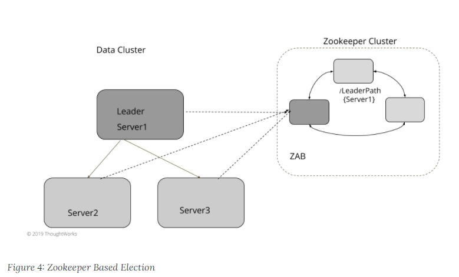

### Why Quorum read/writes are not enough for strong consistency guarantees

It might look like Quorum read/write, provided by Dynamo style databases like Cassandra, is enough for getting strong consistency in case of server failures. But that is not the case. Consider the following example. Let's say we have a cluster with three servers. Variable x is stored on all three servers. (It has a replication factor of 3). Value of x = 1 at startup.

- Let’s say writer1 writes x = 2, with replication factor of 3. The write request is sent to all the three servers. The write is successful on server1 but fails for server2 and server3. (either a network glitch or writer1 just went into a long garbage collection pause after sending the write request to server1.).
- Client c1 reads the value of x from server1 and server2. It gets the latest value of x=2 because server1 has the latest value
- Client c2 triggers a read for x. But Server1 goes down temporarily. So c1 reads it from server2, server3, which have old values for x, x=1. So c2 gets the old value even when it read it after c1 read the latest value

This way two consecutive reads show the latest values disappearing. Once server1 comes back up, subsequent reads will give the latest value. And assuming the read repair or anti entropy process is running, the rest of the servers will get the latest value as well ‘eventually’. But there is no guarantee provided by the storage cluster to make sure that once a particular value is visible to any clients, all subsequent reads will continue to get that value even if a server fails.

## HeartBeat

*Show a server is available by periodically sending a message to all the other servers.*

### Problem

When multiple servers form a cluster, the servers are responsible for storing some portion of the data, based on the partitioning and replication schemes used. Timely detection of server failures is important to make sure corrective actions can be taken by making some other server responsible for handling requests for the data on failed servers.

### Solution

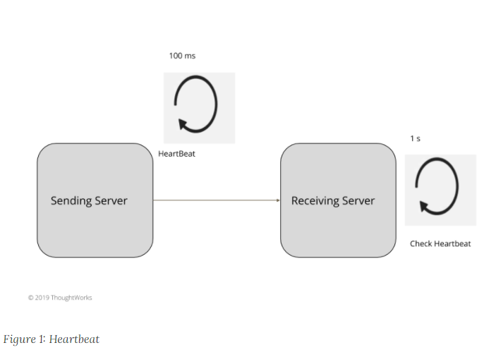

Periodically send a request to all the other servers indicating liveness of the sending server. Select the request interval to be more than the network round trip time between the servers. All the servers wait for the timeout interval, which is multiple of the request interval to check for the heartbeats. In general,

**Timeout Interval > Request Interval > Network round trip time between the servers.**

e.g. If the network round trip time between the servers is 20ms, the heartbeats can be sent every 100ms, and servers check after 1 second to give enough time for multiple heartbeats to be sent and not get false negatives. If no heartbeat is received in this interval, then it declares the sending server as failed.

Both the servers, the one sending the heartbeat and the one receiving it, have a scheduler defined as follows. The scheduler is given a method to be executed at a regular interval. When started, the task is scheduled to execute the given method.

```java
  public class HeartBeatScheduler implements Logging {
      private ScheduledThreadPoolExecutor executor = new ScheduledThreadPoolExecutor(1);
  
      private Runnable action;
      private Long heartBeatInterval;
      public HeartBeatScheduler(Runnable action, Long heartBeatIntervalMs) {
          this.action = action;
          this.heartBeatInterval = heartBeatIntervalMs;
      }
  
      private ScheduledFuture<?> scheduledTask;
      public void start() {
          scheduledTask = executor.scheduleWithFixedDelay(new HeartBeatTask(action), heartBeatInterval, heartBeatInterval, TimeUnit.MILLISECONDS);
      }
```

On the sending server side, the scheduler executes a method to send heartbeat messages.

```java
  private void sendHeartbeat() throws IOException {
      socketChannel.blockingSend(newHeartbeatRequest(serverId));
  }
```

On the receiving server, the failure detection mechanism has a similar scheduler started. At regular intervals, it checks if the heartbeat was received or not.

```java
  private HeartBeatScheduler heartbeatScheduler = new HeartBeatScheduler(this::heartBeatCheck, 100l);

  abstract void heartBeatCheck();
  abstract void heartBeatReceived(T serverId);
```

The failure detector needs to have two methods:

- A method to be called whenever the receiving server receives the heartbeat, to tell the failure detector that heartbeat is received 
 ```java
  private void handleRequest(Message<RequestOrResponse> request) {
        RequestOrResponse clientRequest = request.getRequest();
        if (isHeartbeatRequest(clientRequest)) {
            HeartbeatRequest heartbeatRequest = JsonSerDes.deserialize(clientRequest.getMessageBodyJson(), HeartbeatRequest.class);
            failureDetector.heartBeatReceived(heartbeatRequest.getServerId());
            sendResponse(request);
        } else {
            //processes other requests
        }
    }
 ```

- A method to periodically check the heartbeat status and detect possible failures.

The implementation of when to mark a server as failed depends on various criteria. There are different trade offs. In general, the smaller the heartbeat interval, the quicker the failures are detected, but then there is higher probability of false failure detections. So the heartbeat intervals and interpretation of missing heartbeats is implemented as per the requirements of the cluster. In general there are following two broad categories.

### Small Clusters - e.g. Consensus Based Systems like RAFT, Zookeeper

In all the consensus implementations, Heartbeats are sent from the leader server to all followers servers. Every time a heartbeat is received, the timestamp of heartbeat arrival is recorded

```java
  @Override
  void heartBeatReceived(T serverId) {
      Long currentTime = System.nanoTime();
      heartbeatReceivedTimes.put(serverId, currentTime);
      markUp(serverId);
  }
```

If no heartbeat is received in a fixed time window, the leader is considered crashed, and a new server is elected as a leader. There are chances of false failure detection because of slow processes or networks. So [Generation Clock](https://martinfowler.com/articles/patterns-of-distributed-systems/generation.html) needs to be used to detect the stale leader. This provides better availability of the system, as crashes are detected in smaller time periods. This is suitable for smaller clusters, typically 3 to 5 node setup which is observed in most consensus implementations like Zookeeper or Raft.

```java
  @Override
  void heartBeatCheck() {
      Long now = System.nanoTime();
      Set<T> serverIds = heartbeatReceivedTimes.keySet();
      for (T serverId : serverIds) {
          Long lastHeartbeatReceivedTime = heartbeatReceivedTimes.get(serverId);
          Long timeSinceLastHeartbeat = now - lastHeartbeatReceivedTime;
          if (timeSinceLastHeartbeat >= timeoutNanos) {
              markDown(serverId);
          }
      }
  }
```

### Technical Considerations

When [Single Socket Channel](https://martinfowler.com/articles/patterns-of-distributed-systems/single-socket-channel.html) is used to communicate between servers, care must be taken to make sure that the [[head-of-line-blocking\]](https://en.wikipedia.org/wiki/Head-of-line_blocking) does not prevent heartbeat messages from being processed. Otherwise it can cause delays long enough to falsely detect the sending server to be down, even when it was sending heart beats at the regular intervals. [Request Pipeline](https://martinfowler.com/articles/patterns-of-distributed-systems/request-pipeline.html) can be used to make sure servers do not wait for the response of previous requests before sending heartbeats. Sometimes, when using [Singular Update Queue](https://martinfowler.com/articles/patterns-of-distributed-systems/singular-update-queue.html), some tasks like disk writes, can cause delays which might delay processing of timing interrupts and delay sending heartbeats.

This can be solved by using a separate thread for sending heartbeats asynchronously. Frameworks like [[consul\]](https://www.consul.io/) and [[akka\]](https://akka.io/) send heartbeats asynchronously. This can be the issue on receiving servers as well. A receiving server doing a disk write, can check the heartbeat only after the write is complete, causing false failure detection. So the receiving server using [Singular Update Queue](https://martinfowler.com/articles/patterns-of-distributed-systems/singular-update-queue.html) can reset its heartbeat-checking mechanism to incorporate those delays. Reference implementation of [[raft\]](https://raft.github.io/), [[log-cabin\]](https://github.com/logcabin/logcabin) does this.

Sometimes, a [[local-pause\]](https://issues.apache.org/jira/browse/CASSANDRA-9183) because of some runtime-specific events like Garbage Collection can delay the processing of heartbeats. There needs to be a mechanism to check if the processing is happening after a possible local pause. A simple mechanism, to use is to check if the processing is happening after a long enough time window, e.g. 5 seconds. In that case nothing is marked as failed based on the time window, and it's deferred to the next cycle. [Implementation in Cassandra ](https://issues.apache.org/jira/browse/CASSANDRA-9183)is a good example of this.

### Large Clusters. Gossip Based Protocols

Heartbeating, described in the previous section, does not scale to larger clusters with a few hundred to thousand servers spanning across wide area networks. In large clusters, two things need to be considered:

- Fixed limit on the number of messages generated per server
- The total bandwidth consumed by the heartbeat messages. It should not consume a lot of network bandwidth. There should be an upper bound of a few hundred kilo bytes, making sure that too many heartbeat messages do not affect actual data transfer across the cluster.

For these reasons,all-to-all heartbeating is avoided. Failure detectors, along with [Gossip](https://en.wikipedia.org/wiki/Gossip_protocol) protocols for propagating failure information across the cluster are typically used in these situations. These clusters typically take actions like moving data across nodes in case of failures, so prefer correct detections and tolerate some more delays (although bounded). The main challenge is not to incorrectly detect a node as faulty because of network delays or slow processes. A common mechanism used then, is for each process to be assigned a suspicion number, which increments if there is no gossip including that process in bounded time. It's calculated based on past statistics, and only after this suspicion number reaches a configured upper limit, is it marked as failed.

There are two mainstream implementations: 1) Phi Accrual failure detector (used in Akka, Cassandra) 2) SWIM with Lifeguard enhancement (used in Hashicorp Consul, memberlist) These implementations scale over a wide area network with thousands of machines. Akka is known to be tried for [2400](https://www.lightbend.com/blog/running-a-2400-akka-nodes-cluster-on-google-compute-engine) servers. Hashicorp Consul is routinely deployed with several thousand consul servers in a group. Having a reliable failure detector, which works efficiently for large cluster deployments and at the same time provides some consistency guarantees, remains an area of active development. Some recent developments in frameworks like [Rapid](https://www.usenix.org/conference/atc18/presentation/suresh) look promising.

## Generation Clock

*A monotonically increasing number indicating the generation of the server.*

### Problem

In [Leader and Followers](https://martinfowler.com/articles/patterns-of-distributed-systems/leader-follower.html) setup, there is a possibility of the leader being temporarily disconnected from the followers. There might be a garbage collection pause in the leader process, or a temporary network disruption which disconnects the leader from the follower. In this case the leader process is still running, and after the pause or the network disruption is over, it will try sending replication requests to the followers. This is dangerous, as meanwhile the rest of the cluster might have selected a new leader and accepted requests from the client. It is important for the rest of the cluster to detect any requests from the old leader. The old leader itself should also be able to detect that it was temporarily disconnected from the cluster and take necessary corrective action to step down from leadership.

### Solution

Maintain a monotonically increasing number indicating the generation of the server. Every time a new leader election happens, it should be marked by increasing the generation. The generation needs to be available beyond a server reboot, so it is stored with every entry in the [Write-Ahead Log](https://martinfowler.com/articles/patterns-of-distributed-systems/wal.html). As discussed in [High-Water Mark](https://martinfowler.com/articles/patterns-of-distributed-systems/high-watermark.html), followers use this information to find conflicting entries in their log.

At startup, the server reads the last known generation from the log.

With [Leader and Followers](https://martinfowler.com/articles/patterns-of-distributed-systems/leader-follower.html) servers increment the generation every time there's a new leader election.

```java
  private void startLeaderElection() {
      replicationState.setGeneration(replicationState.getGeneration() + 1);
      registerSelfVote();
      requestVoteFrom(followers);
  }
```

The servers send the generation to other servers as part of the vote requests. This way, after a successful leader election, all the servers have the same generation. Once the leader is elected, followers are told about the new generation

```java
  private void becomeFollower(Long generation) {
      replicationState.setGeneration(generation);
      transitionTo(ServerRole.FOLLOWING);
  }
```

Thereafter, the leader includes the generation in each request it sends to the followers. It includes it in every [HeartBeat](https://martinfowler.com/articles/patterns-of-distributed-systems/heartbeat.html) message as well as the replication requests sent to followers

Leader persists the generation along with every entry in its [Write-Ahead Log](https://martinfowler.com/articles/patterns-of-distributed-systems/wal.html)

```java
  Long appendToLocalLog(byte[] data) {
      var logEntryId = wal.getLastLogEntryId() + 1;
      var logEntry = new WALEntry(logEntryId, data, EntryType.DATA, replicationState.getGeneration());
      return wal.writeEntry(logEntry);
  }
```

This way, it is also persisted in the follower log as part of the replication mechanism of [Leader and Followers](https://martinfowler.com/articles/patterns-of-distributed-systems/leader-follower.html)

If a follower gets a message from a deposed leader, the follower can tell because its generation is too low. The follower then replies with a failure response.

```java
  Long currentGeneration = replicationState.getGeneration();
  if (currentGeneration > replicationRequest.getGeneration()) {
      return new ReplicationResponse(FAILED, serverId(), currentGeneration, wal.getLastLogEntryId());
  }
```

When a leader gets such a failure response, it becomes a follower and expects communication from the new leader.

```java
  if (!response.isSucceeded()) {
      stepDownIfHigherGenerationResponse(response);
      return;
  }

private void stepDownIfHigherGenerationResponse(ReplicationResponse replicationResponse) {
      if (replicationResponse.getGeneration() > replicationState.getGeneration()) {
          becomeFollower(replicationResponse.getGeneration());
      }
  }
```


Consider the following example. In the three server cluster, leader1 is the existing leader. All the servers in the cluster have the generation as 1. Leader1 sends continuous heartbeats to the followers. Leader1 has a long garbage collection pause, for say 5 seconds. The followers did not get a heartbeat, and timeout to elect a new leader. The new leader increments the generation to 2. After the garbage collection pause is over, leader1 continues sending the requests to other servers. The followers and the new leader which are at generation 2, reject the request and send a failure response with generation 2. leader1 handles the failure response and steps down to be a follower, with generation updated to 2.

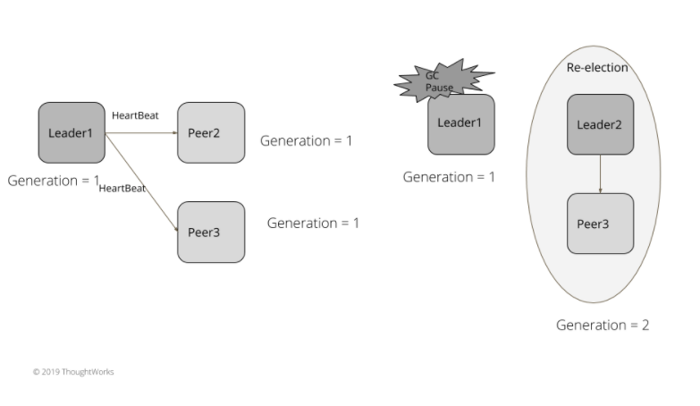


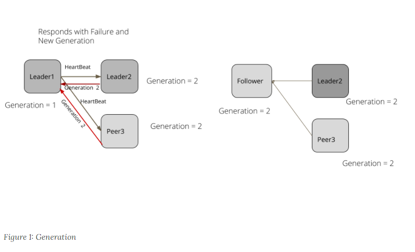

## Single Socket Channel

*Maintain order of the requests sent to a server by using a single TCP connection.*

### Problem

When we are using [Leader and Followers](https://martinfowler.com/articles/patterns-of-distributed-systems/leader-follower.html), we need to ensure that messages between the leader and each follower are kept in order, with a retry mechanism for any lost messages. We need to do this while keeping the cost of new connections low, so that opening new connections doesn't increase the system's latency.

### Solution

Fortunately, the long-used and widely available [TCP](https://en.wikipedia.org/wiki/Transmission_Control_Protocol) mechanism provides all these necessary characteristics. Thus we can get the communication we need by ensuring all communication between a follower and its leader goes through a single socket channel. The follower then serializes the updates from leader using a [Singular Update Queue](https://martinfowler.com/articles/patterns-of-distributed-systems/singular-update-queue.html)

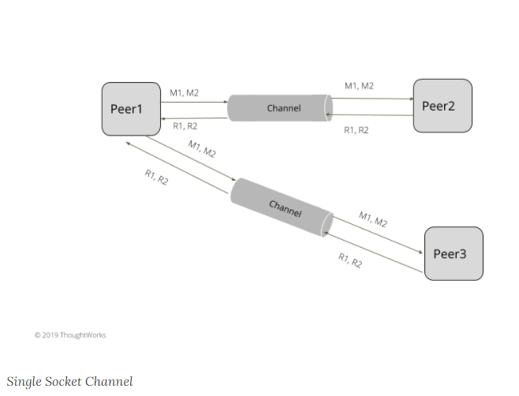

Nodes never close the connection once it is open and continuously read it for new requests. Nodes use a dedicated thread per connection to read and write requests. A thread per connection isn't needed if [non blocking io](https://en.wikipedia.org/wiki/Non-blocking_I/O_(Java)) is used.

A simple-thread based implementation will be like the following:

```java
 @Override
  public void run() {
      try {
          //Continues to read/write to the socket connection till it is closed.
          while (true) {
              handleRequest();
          }
      } catch (Exception e) {
          getLogger().debug(e);
      }
  }

   private void handleRequest() {
      RequestOrResponse request = readRequestFrom(clientSocket);
      RequestId requestId = RequestId.valueOf(request.getRequestId());
      requestConsumer.accept(new Message<>(request, requestId, clientSocket));
    }
```

The node reads requests and submits them to a [Singular Update Queue](https://martinfowler.com/articles/patterns-of-distributed-systems/singular-update-queue.html) for processing. Once the node has processed the request it writes the response back to the socket.

Whenever a node establishes a communication it opens a single socket connection that's used for all requests with the other party.

```java
  public class SingleSocketChannel implements Closeable {
      private Socket clientSocket;
      private final OutputStream socketOutputStream;
      private final InputStream inputStream;
  
      public SingleSocketChannel(InetAddressAndPort address, int heartbeatIntervalMs) throws IOException {
          clientSocket = new Socket(address.getAddress(), address.getPort());
          clientSocket.setSoTimeout(heartbeatIntervalMs * 10); //set socket read timeout to be more than heartbeat.
          socketOutputStream = clientSocket.getOutputStream();
          inputStream = clientSocket.getInputStream();
      }
  
      public RequestOrResponse blockingSend(RequestOrResponse request) throws IOException {
          writeRequest(request);
          byte[] responseBytes = readResponse();
          return deserialize(responseBytes);
      }
  
      private void writeRequest(RequestOrResponse request) throws IOException {
          var dataStream = new DataOutputStream(socketOutputStream);
          byte[] messageBytes = serialize(request);
          dataStream.writeInt(messageBytes.length);
          dataStream.write(messageBytes);
      }
```

It's important to keep a timeout on the connection so it doesn't block indefinitely in case of errors. We use [HeartBeat](https://martinfowler.com/articles/patterns-of-distributed-systems/heartbeat.html) to send requests periodically over the socket channel to keep it alive. This timeout is generally kept as a multiple of the HeartBeat interval, to allow for network round trip time and some possible network delays. It's reasonable to keep the connection timeout as say 10 times that of the HeartBeat interval.

```java
  private void setReadTimeout(Socket clientSocket) throws SocketException {
      clientSocket.setSoTimeout(config.getHeartBeatIntervalMs() * 10);
  }
```

Sending requests over a single channel can create a problem with [head of line blocking](https://en.wikipedia.org/wiki/Head-of-line_blocking) issues. To avoid these, we can use a [Request Pipeline](https://martinfowler.com/articles/patterns-of-distributed-systems/request-pipeline.html).

## Singular Update Queue

*User a single thread to process requests asynchronously to maintain order without blocking the caller.*

### Problem

When the state needs to be updated by multiple concurrent clients, we need it to be safely updated with one at a time changes. Consider the example of the [Write-Ahead Log](https://martinfowler.com/articles/patterns-of-distributed-systems/wal.html) pattern. We need entries to be processed one at a time, even if several concurrent clients are trying to write. Generally locks are used to protect against concurrent modifications. But if the tasks being performed are time consuming, like writing to a file, blocking all the other calling threads until the task is completed can have severe impact on overall system throughput and latency. It is important to make effective use of compute resources, while still maintaining the guarantee of one at a time execution.

### Solution

Implement a workqueue and a single thread working off the queue. Multiple concurrent clients can submit state changes to the queue. But a single thread works on state changes. This can be naturally implemented with goroutines and channels in languages like golang.

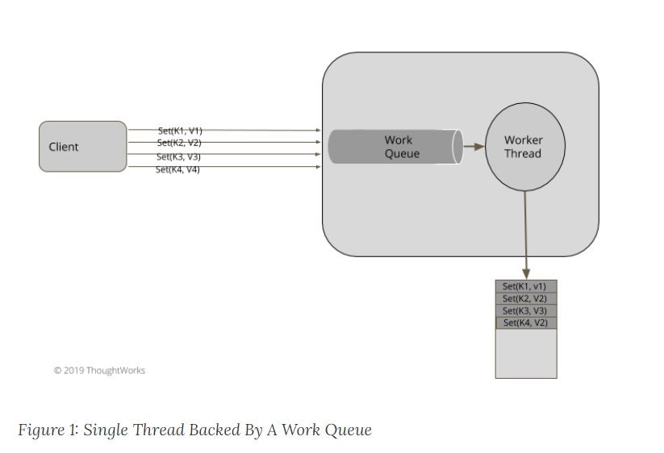

A SingularUpdateQueue has a queue and a function to be applied for work items in the queue. It extends from java.lang.Thread, to make sure that it has its own single thread of execution.

```java
public class SingularUpdateQueue<Req, Res> extends Thread implements Logging {
    private ArrayBlockingQueue<RequestWrapper<Req, Res>> workQueue
            = new ArrayBlockingQueue<RequestWrapper<Req, Res>>(100);
    private Function<Req, Res> handler;
    private volatile boolean isRunning = false;
```

Clients submit requests to the queue on their own threads. The queue wraps each request in a simple wrapper to combine it with a future, returning the future to the client so that the client can react once the request is eventually completed.

```java
  public CompletableFuture<Res> submit(Req request) {
      try {
          var requestWrapper = new RequestWrapper<Req, Res>(request);
          workQueue.put(requestWrapper);
          return requestWrapper.getFuture();
      }
      catch (InterruptedException e) {
          throw new RuntimeException(e);
      }
  }
class RequestWrapper<Req, Res> {
    private final CompletableFuture<Res> future;
    private final Req request;

    public RequestWrapper(Req request) {
        this.request = request;
        this.future = new CompletableFuture<Res>();
    }
    public CompletableFuture<Res> getFuture() { return future; }
    public Req getRequest()                   { return request; }
```

The elements in the queue are processed by the single dedicated thread that `SingularUpdateQueue` inherits from `Thread`. The queue allows multiple concurrent producers to add the tasks for execution. The queue implementation should be thread safe, and should not add a lot of overhead under contention. The execution thread picks up requests from the queue and process them one at a time. The CompletableFuture is completed with the response of the task execution.

```java
@Override
  public void run() {
       isRunning = true;
       while(isRunning) {
           Optional<RequestWrapper<Req, Res>> item = take();
           item.ifPresent(requestWrapper -> {
               try {
                   Res response = handler.apply(requestWrapper.getRequest());
                   requestWrapper.complete(response);

               } catch (Exception e) {
                   requestWrapper.completeExceptionally(e);
               }
           });
      }
  }

  public void complete(Res response) {
      future.complete(response);
  }

  public void completeExceptionally(Exception e) {
      getFuture().completeExceptionally(e);
  }
```

It's useful to note that we can put a timeout while reading items from the queue, instead of blocking it indefinitely. It allows us to exit the thread if needed, with isRunning set to false, and the queue will not block indefinitely if it's empty, blocking the execution thread. So we use the poll method with a timeout, instead of the take method, which blocks indefinitely. This gives us the ability to shutdown the thread of execution cleanly.

```java
private Optional<RequestWrapper<Req, Res>> take() {
	try {
          return Optional.ofNullable(workQueue.poll(300, TimeUnit.MILLISECONDS));

      } catch (InterruptedException e) {
          return Optional.empty();
      }
  }


  public void shutdown() {
      this.isRunning = false;
  }
```

For example, a server processing requests from multiple clients and updating write ahead log, can have use a SingularUpdateQueue as following.

A client of the SingularUpdateQueue would set it up by specifying its paramaterized types and the function to run when processing the message from the queue. For this example, we're using a consumer of requests for a write ahead log. There is a single instance of this consumer, which will control access to the log data structure. The consumer needs to put each request into a log and then return a response. The response message can only be sent after the message has been put into the log. We use a SingularUpdateQueue to ensure there's a reliable ordering for these actions.

```java
public class WalRequestConsumer implements Consumer<Message<RequestOrResponse>> {

    private final SingularUpdateQueue<Message<RequestOrResponse>, Message<RequestOrResponse>> walWriterQueue;
    private final WriteAheadLog wal;

    public WalRequestConsumer(Config config) {
        this.wal = WriteAheadLog.openWAL(config);
        walWriterQueue = new SingularUpdateQueue<>((message) -> {
            wal.writeEntry(serialize(message));
            return responseMessage(message);
        });
        startHandling();
    }

    private void startHandling() { this.walWriterQueue.start(); }
```

The consumer's accept method takes messages, puts them on the queue and after each message is processed, sends a response. This method is run on the caller's thread, allowing many callers to invoke `accept` at the same time.

```java
@Override
public void accept(Message message) {
    CompletableFuture<Message<RequestOrResponse>> future = walWriterQueue.submit(message);
    future.whenComplete((responseMessage, error) -> {
        sendResponse(responseMessage);
    });
}
```

### Choice of the queue

The choice of the queue data structure is an important one to be made. On JVM, there are various data structures available to chose from:

- **ArrayBlockingQueue** (Used in Kafka request queue)

  As the name suggests, this is an array-backed blocking queue. This is used when a fixed bounded queue needs to be created. Once the queue fills up, the producer will block. This provides blocking backpressure and is helpful when we have slow consumers and fast producers

- **ConcurrentLinkedQueue** along with ForkJoinPool (Used in Akka Actors mailbox implementation)

  ConcurrentLinkedQueue can be used when we do not have consumers waiting for the producer, but there is some coordinator which schedules consumers only after tasks are queued onto the ConcurrentLinkedQueue.

- **LinkedBlockingDeque** (Used By Zookeeper and Kafka response queue)

  This is mostly used when unbounded queuing needs to be done, without blocking the producer. We need to be careful with this choice, as the queue might fill up quickly if no backpressure techniques are implemented and can go on consuming all the memory

- **RingBuffer** (Used in LMAX Disruptor, )

  As discussed in LMAX Disruptor, sometimes, task processing is latency sensitive. So much so, that copying tasks between processing stages with ArrayBlockingQueue can add to latencies which are not acceptable. [RingBuffer](https://lmax-exchange.github.io/disruptor/files/Disruptor-1.0.pdf) can be used in these cases to pass tasks between stages.

### Using Channels and Lightweight Threads.

This can be a natural fit for languages or libraries which support lightweight threads along with the concept of channels (e.g. golang, kotlin). All the requests are passed to a single channel to be processed. There is a single goroutine which processes all the messages to update state. The response is then written to a separate channel, and processed by separate goroutine to send it back to clients. As seen in the following code, the requests to update key value are passed onto a single shared request channel.

```go
func (s *server) putKv(w http.ResponseWriter, r *http.Request)  {
  kv, err := s.readRequest(r, w)
  if err != nil {
    log.Panic(err)
    return
  }

  request := &requestResponse{
    request:         kv,
    responseChannel: make(chan string),
  }

  s.requestChannel <- request
  response := s.waitForResponse(request)
  w.Write([]byte(response))
}
```

The requests are processed in a single goroutine to update all the state.

```go
func (s* server) Start() error {
  go s.serveHttp()

  go s.singularUpdateQueue()

  return nil
}

func (s *server) singularUpdateQueue() {
  for {
    select {
    case e := <-s.requestChannel:
      s.updateState(e)
      e.responseChannel <- buildResponse(e);
    }
  }
}
```

### Backpressure

Backpressure can be an important concern when a work queue is used to communicate between threads. In case the consumer is slow and the producer is fast, the queue might fill up fast. Unless some precautions are taken, it might run out of memory with a large number of tasks filling up the queue. Generally, the queue is kept bounded with sender blocking if the queue is full. For example, java.util.concurrent.ArrayBlockingQueue has two methods to add elements. put method blocks the producer if the array is full. add method throws IllegalStateException if queue is full, but doesn't block the producer. It's important to know the semantics of the methods available for adding tasks to the queue. In the case of ArrayBlockingQueue, put method should be used to block the sender and provide backpressure by blocking. Frameworks like reactive-streams can help implement a more sophisticated backpressure mechanism from consumer to the producer.

### Other Considerations

- Task Chaining.

  Most of the time the processing needs to be done with chaining multiple tasks together. The results of a SingularUpdateQueue execution need to be passed to other stages. e.g. As shown in the WalRequestConsumer above, after the records are written to the write ahead log, the response needs to be sent over the socket connection. This can be done by executing the future returned by SingularUpdateQueue on a separate thread. It can submit the task to other SingularUpdateQueue as well.

- Making External Service Calls.

  Sometimes, as part of the task execution in the SingularUpdateQueue, external service calls need to be made and the state of the SingularUpdateQueue is updated by the response of the service call. It's important in this scenario that no blocking network calls are made or it blocks the only thread which is processing all the tasks. The calls are made asynchronously. Care must be taken to not access the SingularUpdateQueue state in the future callback of the asynchronous service call because this can happen in a separate thread, defeating the purpose of doing all state changes in SingularUpdateQueue by single thread. The result of the call should be added to the work queue similar to other events or requests.

