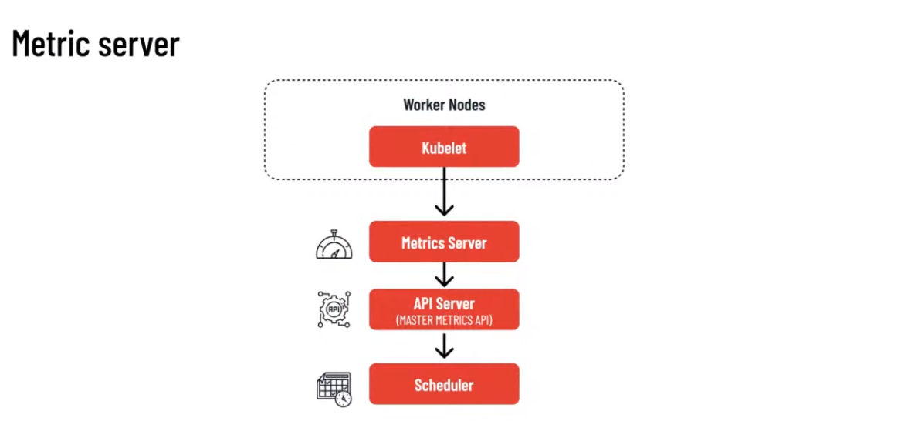

# AKS Scaling

## Scaling Pods

in a K8s environment to scale in or scale out the pod we need to have metrics server installed (a default form the 1.16 version)




we can check the metrics server api


```bash
$> kubectl get --raw "/apis/metrics.k8s.io/v1beta1" | jq .
{
  "kind": "APIResourceList",
  "apiVersion": "v1",
  "groupVersion": "metrics.k8s.io/v1beta1",
  "resources": [
    {
      "name": "nodes",
      "singularName": "",
      "namespaced": false,
      "kind": "NodeMetrics",
      "verbs": [
        "get",
        "list"
      ]
    },
    {
      "name": "pods",
      "singularName": "",
      "namespaced": true,
      "kind": "PodMetrics",
      "verbs": [
        "get",
        "list"
      ]
    }
  ]
}
```

or if we want to get more information about the nodes metrics

```bash
$> kubectl get --raw "/apis/metrics.k8s.io/v1beta1/nodes" | jq .
{
  "kind": "NodeMetricsList",
  "apiVersion": "metrics.k8s.io/v1beta1",
  "metadata": {
    "selfLink": "/apis/metrics.k8s.io/v1beta1/nodes"
  },
  "items": [
    {
      "metadata": {
        "name": "aks-default-04670613-vmss000010",
        "selfLink": "/apis/metrics.k8s.io/v1beta1/nodes/aks-default-04670613-vmss000010",
        "creationTimestamp": "2021-02-12T14:14:09Z"
      },
      "timestamp": "2021-02-12T14:13:24Z",
      "window": "30s",
      "usage": {
        "cpu": "186149702n",
        "memory": "4261116Ki"
      }
    },
    {
      "metadata": {
        "name": "aks-default-04670613-vmss00001d",
        "selfLink": "/apis/metrics.k8s.io/v1beta1/nodes/aks-default-04670613-vmss00001d",
        "creationTimestamp": "2021-02-12T14:14:09Z"
      },
      "timestamp": "2021-02-12T14:13:24Z",
      "window": "30s",
      "usage": {
        "cpu": "213400813n",
        "memory": "4290552Ki"
      }
    },
    {
      "metadata": {
        "name": "aks-default-04670613-vmss00001e",
        "selfLink": "/apis/metrics.k8s.io/v1beta1/nodes/aks-default-04670613-vmss00001e",
        "creationTimestamp": "2021-02-12T14:14:09Z"
      },
      "timestamp": "2021-02-12T14:13:20Z",
      "window": "30s",
      "usage": {
        "cpu": "244890775n",
        "memory": "4314744Ki"
      }
    },
    {
      "metadata": {
        "name": "aks-default-04670613-vmss000000",
        "selfLink": "/apis/metrics.k8s.io/v1beta1/nodes/aks-default-04670613-vmss000000",
        "creationTimestamp": "2021-02-12T14:14:09Z"
      },
      "timestamp": "2021-02-12T14:13:21Z",
      "window": "30s",
      "usage": {
        "cpu": "379161255n",
        "memory": "4019076Ki"
      }
    }
  ]
}
```

```bash
$> kubectl top nodes
NAME                              CPU(cores)   CPU%   MEMORY(bytes)   MEMORY%
aks-default-04670613-vmss000000   404m         21%    3925Mi          73%
aks-default-04670613-vmss000010   183m         9%     4161Mi          77%
aks-default-04670613-vmss00001d   211m         11%    4189Mi          78%
aks-default-04670613-vmss00001e   234m         12%    4213Mi          78%
```

To handle in  the right way the scalability we need to add HPA


The metrics server by default will gather information about the CPU and memory usage.

We are able to add custom metrics using the metrics aggregator.


An alternative to the custom metrics is the is represented by the open source project KEDA


KEDA allows you to scale the pod using some custom metrics like the number of messages in an Azure service Bus topic, or number of messages present in a rabbitMq queue and more


First of all we have to install **KEDA** alongside our K8s cluster in this way

```bash
$> kubectl apply -f https://github.com/kedacore/keda/releases/download/v2.1.0/keda-2.1.0.yaml
```

We can simply add a **ScaledObject** object inside K8s, linked to my deployment, that define a list of triggers that can autoscale my number of POD

The **ScaleObject** is an abstraction on top of HPA.


## Scaling Nodes


to enable cluster autoscaler in  AKS you need to lunch the command

```bash
$> az aks update \
  --enable-cluster-autoscaler \
  --min-count 1 \
  --max-count 3
```


Instead of autoscaler, we can use a different approach to reduce the time (on azure it is called **azure container instance**)


we don't need to spawn and setup a new node, but we can use the azure container instance to schedule the new POD and in this way we are more and more rapid on scale.