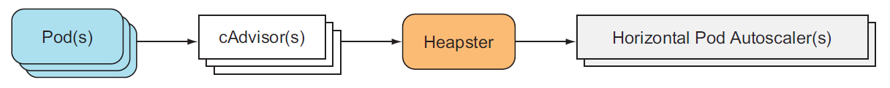

# Horizontal Pod Autoscaler


## Concepts

- Horizontal pod autoscaling is the automatic scaling of the number of pod replicas managed
  by a controller
- The controller periodically checks pod metrics, calculates the number of replicas required to meet
  the target metric value configured in the HorizontalPodAutoscaler resource
- The Pod autoscaler gather Pods metrics information (Cpu, Memory, ecc.) from Heapster.
- cAdvisor which run in  the Kubelet node is responsible to to fill information of Heapster.



- If you want to autoscale based on a resource's utilization as a percentage, you must specify requests for that resource
- you can autoscale a service using the kubelet **autoscale** (autoscale maintains between a min and a max number the POD)

- We can enable autoscaler by running

```bash
kubectl autoscale deployment <name> --cpu-percent=50 --min=1 --max=10
```

- HPA will increase and decrease the number of replicas to maintain an average CPU utilization across all Pods of 50%

  

- We can check the status of autoscaler by running

```bash
kubectl get hpa
```


- Instead of using `kubectl autoscale` command to create a **HorizontalPodAutoscaler** imperatively we can use the following file to create it declaratively:

```yaml
apiVersion: autoscaling/v2beta2
kind: HorizontalPodAutoscaler
metadata:
  name: ott-entitlements-provider
  namespace: default
spec:
  scaleTargetRef:
    apiVersion: apps/v1
    kind: Deployment
    name: ott-entitlements-provider
  minReplicas: 1
  maxReplicas: 10
  metrics:
  - type: Resource
    resource:
      name: cpu
      target:
        type: Utilization
        averageUtilization: 50
  - type: Resource
    resource:
        name: memory
        target:
          type: Utilization
          averageUtilization: 50
```


## Algorithm details

From the most basic perspective, the Horizontal Pod Autoscaler controller operates on the ratio between desired metric value and current metric value

```c#
desiredReplicas = ceil[currentReplicas * ( currentMetricValue / desiredMetricValue )]
```

> For example, if the current metric value is `200m`, and the desired value is `100m`, the number of replicas will be doubled, since `200.0 / 100.0 == 2.0`

> If the current value is instead `50m`, we’ll halve the number of replicas, since `50.0 / 100.0 == 0.5`


Useful links

- https://kubernetes.io/docs/tasks/run-application/horizontal-pod-autoscale-walkthrough/
- https://kubernetes.io/docs/tasks/run-application/horizontal-pod-autoscale/
- https://kubernetes.io/docs/concepts/workloads/controllers/deployment/
- https://codeburst.io/practical-guide-to-kubernetes-scaling-1-pods-5a7ed08f4e8b

