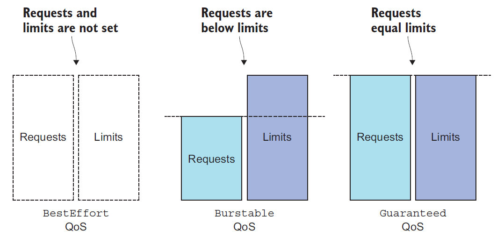

# Pods Computation Resources


## Resources Requests

- When creating a pod, you can specify the amount of CPU and memory that a container
  needs (these are called requests)
  
  
  
- Example of Pod yaml configuration file
  
  ```yaml
  apiVersion: v1
  kind: Pod
  metadata:
  	name: requests-pod
  spec:
  	containers:
  	- image: imageofthepod	  
         name: main
         resources:
           requests:
             cpu: 200m
             memory: 10Mi
  ```
  
- In the pod manifest, your single container requires one-fifth of a CPU core (200 millicores)
  to run properly; Five such pods/containers can run sufficiently fast on a single
  CPU core

  

- By specifying resource requests, you’re specifying the minimum amount of resources
  your pod needs. This information is what the Scheduler uses when scheduling the pod
  to a node

- What’s important and somewhat surprising here is that the Scheduler doesn’t look at
  how much of each individual resource is being used at the exact time of scheduling
  but at the sum of resources requested by the existing pods deployed on the node


- The scheduler need to inspect the node's capacity in order to determine where to schedule the Pod

  - The kubelet reports metrics abut CPU and memory of the nodes to API server, making it available through the **node resource**

  - ```bash
    kubectl describe nodes
    ```

  - The output shows two sets of amounts related to the available resources on the node:
    the node’s capacity and allocatable resources

    - The capacity represents the total resources of a node, which may not all be available to pods.

- Incase of node fully satured in terms of CPU and or memory and you want to schedule another Pod, this one enter in a **pending** state waiting for node resources to be scheduled

- In that case you can also determine the reason why the Pod isn't schedule using the kubectl describe node command

- The CPU requests don’t only affect scheduling—they also determine how the remaining (unused) CPU time is distributed between pods


## Resources Limits

- You may want to prevent certain containers from using up more than a specific amount of CPU, and you’ll always want to limit the amount of memory a container can consume

- CPU is a **compressible** resource, which means the amount used by a container can be throttled without affecting the process running in the container in an adverse way

- Memory is obviously different, it’s **incompressible**

- Without limiting memory, a container (or a pod) running on a worker node may eat up all the available memory and affect all other pods on the node and any new pods scheduled to the node

  

- Example hoe to set the limits

  ```yaml
  apiVersion: v1
  kind: Pod
  metadata:
    name: limited-pod
  spec:
    containers:
    - image: imageofthepod    
    name: main
    resources:
      limits:
        cpu: 1
        memory: 20Mi
  ```

- The sum of all limits of all the pods on a node is allowed to exceed 100% of the node’s capacity

- When 100% of the node’s resources are used up, certain containers will need to be killed

  

- What happen when a process try to use greater amount of resources

  - a process’ CPU usage is throttled, so when a CPU limit is set for a container
  - When a process tries to allocate memory over its limit, the process is killed, **OOMKilled**, Out Of Memory Killed

> Kubelet is increasing the time period before restarting the container. After the first crash, it restarts the container immediately and then, if it crashes again, waits for 10 seconds before restarting it again. On subsequent crashes, this delay is then increased exponentially to 20, 40, 80, and 160 seconds, and finally limited to 300 seconds. Once the interval hits the 300-second limit, the Kubelet keeps restarting the container indefinitely every five minutes until the pod either stops crashing or is deleted


## Pod QoS classes

Kubernetes categorize pods into three **Quality of Service** (QoS) classes

- **BestEffort** (the lowest priority)
- **Burstable**
- **Guaranteed** (the highest)

These three classes of QoS is derived from the combination of resource requests and limits


### BESTEFFORT

It’s assigned to pods that don’t have any requests or limits set at all (in any of their containers)

In the worst case, they may get almost no CPU time at all and will be the first ones killed when memory needs to be freed for other pods


### GUARANTEED

This class is given to pods whose containers’ requests are equal to the limits for all resources

These three  things need to be true

- Requests and limits need to be set for both CPU and memory.
- They need to be set for each container
- They need to be equal

### BURSTABLE

This includes single-container pods where the container’s limits don’t match its requests and all pods where at least one container has a resource request specified, but not the limit

 


- When the system is overcommitted, the QoS classes determine which container gets killed first so the freed resources can be given to higher priority pods
- First in line to get killed are pods in the BestEffort class, followed by Burstable pods, and finally Guaranteed pods, which only get killed if system processes need memory
- Each running process has an OutOfMemory (OOM) score. The system selects the process to kill by comparing OOM scores of all the running processes. When memory needs to be freed, the process with the highest score gets killed

## Collecting and retrieving actual resource usages

Kubelet itself already contains an agent called cAdvisor, which performs the basic collection of resource consumption data for both individual containers running on the node and the node as a whole

Gathering those statistics centrally for the whole cluster requires you to run an additional component called Heapster

Heapster runs as a pod on one of the nodes and is exposed through a regular Kubernetes Service, making it accessible at a stable IP address. It collects the data from all cAdvisors in the cluster and exposes it in a single location.


