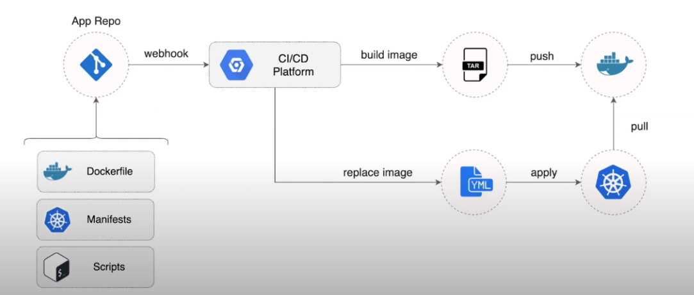
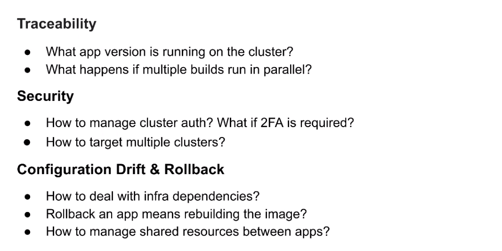
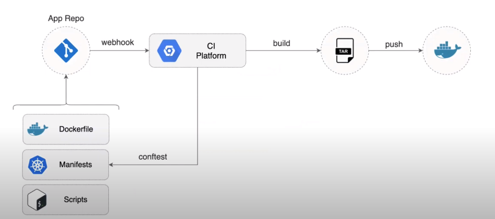
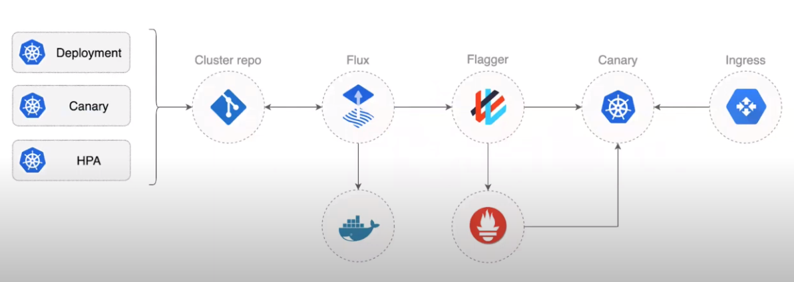
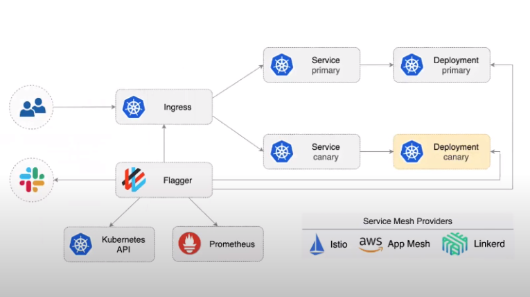
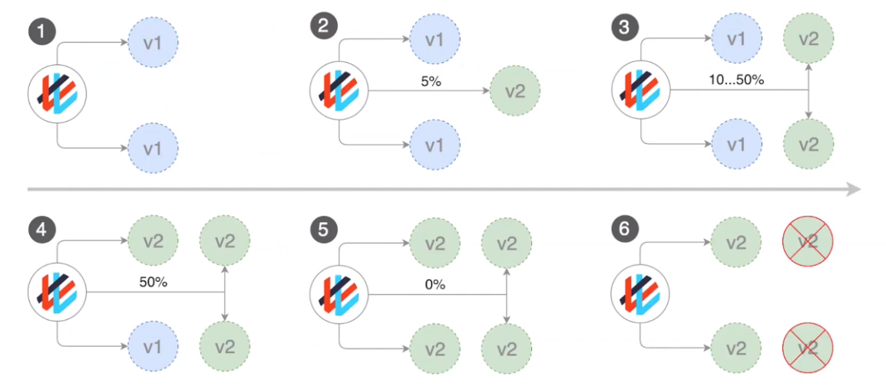
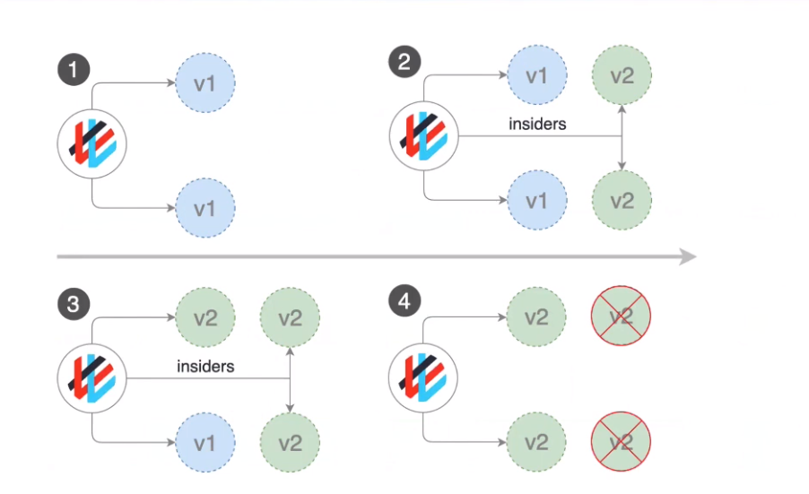
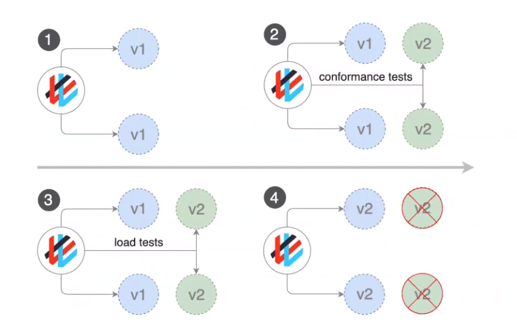

# Flagger

Take a look to a normal CI/CD pipeline is



With this approach you can face some trouble

- if you have shared resources in your repo and run pipelines in parallel there could be a problem with the apply session
- another challenge is about a rollback, running again the pipeline your are going to create a new artifact



One solution to sort out these kind of challenges is about breaking CI and CD

The CI phase should only build and push the artefacts

 

For the delivery part, the CD phase, the proposal is to use a GitOps approach


The CD controller running on cluster is the actor to reconciling the git repository with the cluster state

The challenges with this approach could be


So again, to solve these challenges we can try to break the **deploy** phase from the **release** phase, and here is where **flagger** comes in.



Using **GitOps** when you change something in the cluster manifest repo, **flux** update the changes in the cluster itself using pull strategy. **flagger** comes in and control the new application deployed routing a small amount of traffic at the beginning, and measure all the metrics related to the new version getting them from prometheus (you can also define custom metrics for your app instrumenting flagger to watch about that). If the metrics are good flagger decide to rollout all the new application leveraging on the ingress controller, otherwise the deploy will be aborted and all the traffic will be routed to the old instances of the application.

In this way we can think a flagger as a **progressive delivery tool**.

Flagger is using **traffic management solution** to route the traffic between applications, leveraging on **service mesh** solutions (Istio, Linkerd, App Mesh). 



In case you want to perform progressive delivery leveraging on the ingress controller instead of service mesh, flagger is able to work with **Contour**, **Gloo**, **NGINX** and **Skipper**.

In terms of deployment strategies flagger implements

- **Canary release** for application that expose **HTTP** or **gRPC** APIs 
- **A/B Testing** using HTTP headers and cookie traffic routing
- **Blue/Green** using **traffic monitoring** for idempotents API, or **traffic switching** for stateful applications or no idempotents APIs (in this case flagger run all the testing for the new version and take the decision to move in blue or remain in green)



> how the canary release works



> how the A/B testing works



> how the Blue/Green works


```bash
# git repo -> https://github.com/stefanprodan/gitops-linkerd

# starting from empty kubernetes cluster

# 1 - install flux
$> flux install

# 2 - add a repo to the cluster
$> flux create source git repo-name \
 --url=https://github.com/... \
 --branch=main
 
# 3 - tell flux how to recoincile the infrustructure items (name-of-the item should be linkerd)
$> flux create customization name-of-item \
 --source=repo-name \
 --path=./infrustructure/item-path \
 --prune=true \
 --validation=client \
 --interval=1m \
 --health-check="Deployment/name-of-deploy"

# 4 -configure flagger
$> flux create customization flagger \
 --depennds-on=linkerd \ # previuosily installed
 --source=repo-name \
 --path=./infrustructure/flagger \
 --prune=true \
 --validation=client \
 --interval=1m \
 --health-check="Deployment/flagger-linkerd"
 
# 5 - tell flux how to recoincile countour as well
$> flux create customization contour \
 --depennds-on=linkerd \ # previuosily installed
 --source=repo-name \
 --path=./infrustructure/contour \
 --prune=true \
 --validation=client \
 --interval=1m \
 --health-check="Deployment/contour-projectcontour" \
 --health-check="Demonset/envoy-projectcontour"

# 6 - tell flux to deploy the workloads present in the repo
$> flux create customization workloads \
 --depennds-on=linkerd \ # previuosily installed
 --source=repo-name \
 --path=./workloads \
 --prune=true \
 --validation=client \
 --interval=1m
 
 

```

