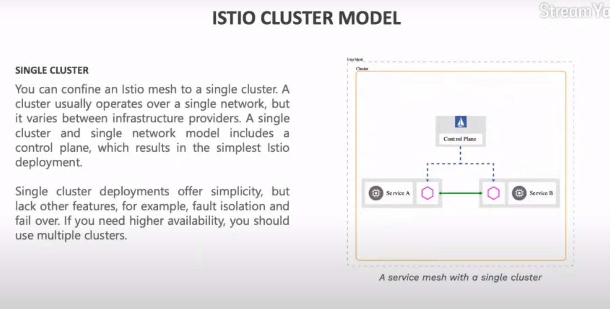

# Multicluster federation with Istio

Multicluster is the ability to view more then one cluster in the same way

Witht the multicluster I am able to deploy the application on more then one porvider/region/availability zone

Actually there is a project called KubeFed in order to handle cluster federation

Using service mesh, a layer that allow the application to communicate each other in a standard way, could be useful to solve this kind of problem (I mean the multi cluster federation)

Service mesh can solve a lot of problem, like service discovery, load balancing, circuit breaker, secure communication, observability, a/b testing, canary deploy, ....

How to deploy Istio service mesh:

## Single cluster installation

## Multi cluster

How can I solve the DNS when I have multi cluster?

we can leverage to dns proxy of istio, so we can avoid to deploy the service in  each cluster.

## Single network model

## Multi network model

in this case we have to use the istio gateway. 

## Istio control plane model

### single control plane in one cluster

### single control plane in multi cluster

### external control plane 

### More control plane on more cluster

### Summary

How can we discover endpoint in different control planes?

# Demo

