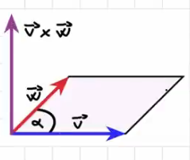

# Vettori

in un sistema cartesiano ogni punto è identificato dalla coppia di numeri reali P(x,y) dove x èlìascissa e y è l'ridnata.
Posso andche definre il vettore OP che parte dal (0,0) a (x,y) e che possiamo indicare con V = (x,y)

nella definzione dei V = (x,y) x e y rappresentano le componenti scalari del vettore.

|v| definisce la norma del vttore, ovvero la lunghezza del segmento orientato.

## Operazioni

### somma

dati due vettori v=(x1,y1) e W=(x2,y2)

v+w = (x1+x2, y1+y2)

la disugualianza triangolare della norma afferma che la norma della somma di due vettori e minore uguale alla somma delle norme dei due vettori

| v + w | <= |v| + |w|

### moltiplicazione per uno scalare

dato il vettore v=(x,y) e il numero scalare k

kv = (kx, ky)

-v è detto l'opposto del vettore v

### prodotto scalare

dati due vettori v=(x1,y1) e W=(x2,y2)

il loro prodotto scalare v*w o <v,w> è dato da

v*W = x1*x2 + y1*y2

ed il risultato è un numero reale

v*W = x1*x2 + y1*y2 = |v| |w| cos(alfa)

dato che 

v * v = x*x + y*y = x^2 + y^2 = |v|^2
|V| = sqrt(v*v)

con il prodotto scalare posso misurare le lunghezze e calcolare gli angoli tra vettori

## vettori nello spazio

v = (x,y,z)

i versori sono i vettori di modulo unitario

i = (1,0,0)
j = (0,1,0)
k = (0,0,1)

combinazione lineare del vettore con le sue componenti e i versori:

v = xi + yj + zk

valgono le stesse operazioni viste in precedenza per i vettori bidimensionali.

### prodotto vettoriale

prende in input due vettori e da come risultato un altro vettore

V=(x1,y1,z1)
W=(x2,y2,z2)

V x W è un vettore che 

- | V x W | = |V| |W| sin(alfa)
- è perpendicolare la piano individuato da V e W
- regola della mano destra

V x W = (y1z2 - y2z1)i + (x2z1 - x1z2)j + (x1y2 - x2y1)k

# Matrici

## spazi vettoriali

### campo

### spazio vettoriale

R^m come spazio vettorialze

Mmxn come spazio vettoriale

